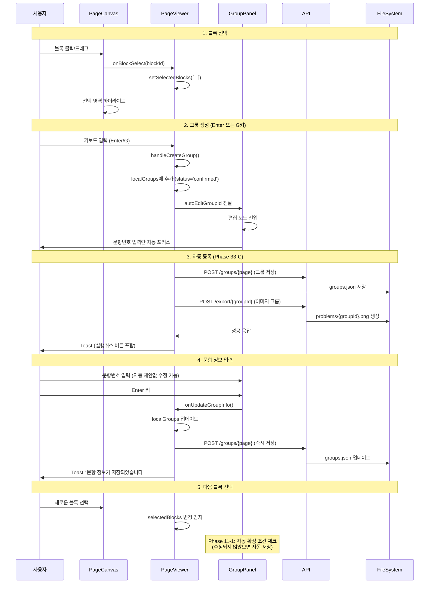

# 라벨링 워크플로우 종합 리포트

**작성일**: 2025-12-04
**Phase**: Phase 33 (통합 워크플로우) 기준
**목적**: 라벨링 작업의 전체 워크플로우 분석 및 개선 포인트 도출

---

## 목차

1. [워크플로우 개요](#1-워크플로우-개요)
2. [주요 컴포넌트 구조](#2-주요-컴포넌트-구조)
3. [데이터 흐름 분석](#3-데이터-흐름-분석)
4. [사용자 인터랙션 시퀀스](#4-사용자-인터랙션-시퀀스)
5. [현재 UX의 강점](#5-현재-ux의-강점)
6. [현재 UX의 약점](#6-현재-ux의-약점)
7. [개선 포인트](#7-개선-포인트)
8. [기술 부채](#8-기술-부채)
9. [결론](#9-결론)

---

## 1. 워크플로우 개요

### 1.1 전체 흐름도

```
사용자 진입
    ↓
[홈페이지] 세션 선택/생성
    ↓
[UnifiedWorkPage] 통합 작업 페이지
    ├─ 문제 탭 (라벨링)
    │   ├─ [PageViewer] 페이지 뷰어
    │   │   ├─ [PageCanvas] 캔버스 (이미지 + 블록 표시)
    │   │   └─ [GroupPanel] 그룹 패널 (문제 정보 입력)
    │   └─ 그룹 생성 → 자동 문제은행 등록
    │
    └─ 해설 탭 (매칭)
        └─ [PageViewer] 해설 문서 뷰어
            └─ 해설 영역 선택 → 문제와 연결
```

### 1.2 핵심 단계

| 단계 | 화면 | 주요 작업 |
|-----|------|----------|
| 1. 세션 생성 | 홈 | 문제 문서 + 해설 문서 지정 |
| 2. 라벨링 | 문제 탭 | 블록 선택 → 그룹 생성 → 메타데이터 입력 |
| 3. 자동 등록 | 백그라운드 | 이미지 크롭 + 문제은행 저장 |
| 4. 매칭 | 해설 탭 | 미연결 문제 선택 → 해설 영역 연결 |
| 5. 동기화 | 백그라운드 | groups.json ↔ session.json 양방향 동기화 |

---

## 2. 주요 컴포넌트 구조

### 2.1 컴포넌트 계층

```
UnifiedWorkPage (통합 작업 페이지)
├─ Header
│  ├─ 세션 정보 표시
│  ├─ 탭 전환 (문제/해설)
│  └─ 진행률 표시
│
├─ Main Canvas
│  └─ PageViewer (페이지 뷰어)
│     ├─ PageNavigation (페이지 이동)
│     ├─ PageCanvas (Konva 캔버스)
│     │  ├─ Image (페이지 이미지)
│     │  ├─ Rect[] (블록 오버레이)
│     │  └─ Group[] (그룹 오버레이)
│     │
│     └─ GroupPanel (그룹 관리)
│        ├─ 그룹 생성 버튼
│        ├─ 그룹 카드[]
│        │  ├─ 문항 정보 표시
│        │  ├─ 편집 모드
│        │  └─ 확정 버튼
│        └─ 통계 표시
│
└─ Footer (미연결 문제 바)
   ├─ 미연결 문제 목록
   └─ 키보드 힌트
```

### 2.2 상태 관리

#### 전역 상태 (Zustand)
- **workSessionStore.ts**: 세션, 문제 목록, 링크 관리
- **tabState**: 현재 탭, 페이지 번호, 선택된 문제

#### 로컬 상태 (React State)
- **PageViewer.tsx**:
  - `localGroups`: 그룹 목록 (자동 저장, 2초 디바운스)
  - `selectedBlocks`: 선택된 블록 ID 배열
  - `autoEditGroupId`: 자동 편집 트리거

- **PageCanvas.tsx**:
  - `image`: 페이지 이미지 객체
  - `isDragging`, `dragStart`, `dragEnd`: 드래그 선택

---

## 3. 데이터 흐름 분석

### 3.1 계층별 데이터 흐름

```
┌─────────────────────────────────────────────────────────┐
│                    Frontend (React)                      │
├─────────────────────────────────────────────────────────┤
│  UnifiedWorkPage                                         │
│    ↓ (세션 로드)                                         │
│  workSessionStore                                        │
│    ↓ (문서 ID 전달)                                      │
│  PageViewer                                              │
│    ↓ (API 호출)                                          │
└─────────────────────────────────────────────────────────┘
                    ↓ HTTP
┌─────────────────────────────────────────────────────────┐
│                   Backend (FastAPI)                      │
├─────────────────────────────────────────────────────────┤
│  blocks.py                                               │
│    - GET /documents/{id}/pages/{page}                   │
│    - POST /documents/{id}/groups/{page}                 │
│                                                          │
│  work_sessions.py                                        │
│    - GET /sessions/{id}                                 │
│    - POST /sessions/{id}/problems                       │
│    - POST /sessions/{id}/links                          │
│    - POST /sessions/{id}/full-sync                      │
└─────────────────────────────────────────────────────────┘
                    ↓ File I/O
┌─────────────────────────────────────────────────────────┐
│                  File System (NAS)                       │
├─────────────────────────────────────────────────────────┤
│  dataset_root/{document_id}/                            │
│    ├─ pages/                                            │
│    │   └─ page_0000.webp (이미지)                       │
│    ├─ blocks/                                           │
│    │   └─ page_0000_blocks.json (블록 데이터)           │
│    ├─ groups/                                           │
│    │   └─ page_0000_groups.json (그룹 + 메타데이터)     │
│    └─ problems/                                         │
│        └─ {group_id}.png (크롭된 문제 이미지)           │
│                                                          │
│  work_sessions/                                         │
│    └─ ws-{session_id}.json (세션 상태)                  │
└─────────────────────────────────────────────────────────┘
```

### 3.2 주요 API 호출 순서

#### 세션 로드 시
```
1. GET /api/sessions/{sessionId}
   → WorkSession 객체 반환

2. POST /api/sessions/{sessionId}/sync-problems
   → groups.json에서 문제 목록 자동 동기화

3. GET /api/documents/{problemDocId}
   → 문제 문서 메타데이터

4. GET /api/documents/{solutionDocId}
   → 해설 문서 메타데이터
```

#### 페이지 로드 시
```
1. GET /api/blocks/documents/{docId}/pages/{pageIndex}
   → PageBlocks (블록 배열)

2. GET /api/blocks/documents/{docId}/groups/{pageIndex}
   → PageGroups (그룹 배열)

3. GET /api/blocks/documents/{docId}/pages/{pageIndex}/image?quality=thumb
   → 썸네일 이미지 (빠른 표시)

4. GET /api/blocks/documents/{docId}/pages/{pageIndex}/image?quality=full
   → 원본 이미지 (지연 로드)
```

#### 그룹 생성 시
```
1. 클라이언트: handleCreateGroup()
   ├─ 로컬 상태 업데이트: localGroups에 추가
   ├─ 자동 편집 모드 트리거: setAutoEditGroupId()
   └─ Phase 33-C: 자동 등록 시작

2. POST /api/blocks/documents/{docId}/groups/{pageIndex}
   → 그룹 정보 저장 (groups.json)

3. POST /api/export/documents/{docId}/pages/{pageIndex}/groups/{groupId}
   → 이미지 크롭 + 문제은행 등록

4. 성공 시: Toast 표시 (실행취소 버튼 포함)
```

### 3.3 자동 저장 메커니즘

#### 디바운스 자동 저장
```typescript
// PageViewer.tsx:343-376
useEffect(() => {
  // 초기 로드 시 저장 방지
  if (isInitialLoadRef.current) return;

  // 기존 타이머 취소
  if (debounceTimerRef.current) {
    clearTimeout(debounceTimerRef.current);
  }

  // 2초 후 자동 저장
  debounceTimerRef.current = setTimeout(() => {
    saveGroups(localGroups, currentPage);
  }, 2000);

}, [localGroups]);
```

#### 명시적 즉시 저장
- **Ctrl+S**: 수동 저장
- **페이지 전환**: 현재 페이지 즉시 저장 후 이동
- **문항 정보 업데이트**: 변경 즉시 저장

---

## 4. 사용자 인터랙션 시퀀스

### 4.1 기본 라벨링 워크플로우 (Phase 33 기준)



### 4.2 세부 인터랙션 흐름

#### A. 드래그 선택
```
1. MouseDown (Stage/Image) → setIsDragging(true)
2. MouseMove (throttled 16ms) → setDragEnd()
3. MouseUp →
   - 겹치는 블록 계산
   - onBlockSelect() 호출 (Ctrl 여부에 따라 다중 선택)
```

#### B. 편집 모드
```
1. 그룹 생성 → autoEditGroupId 설정
2. GroupPanel: useEffect 감지
3. startEditing() 호출
   - 이전 그룹 정보 또는 기본값 로드
   - Phase 10-2: 이전 페이지 마지막 문항번호 기반 자동 증가
4. 입력란 자동 포커스 + 선택
5. Enter → saveEdit()
6. Esc → cancelEdit()
```

#### C. 자동 확정 (Phase 11-1)
```
조건:
- 편집 중 (editingGroupId !== null)
- 새로운 블록 선택 (selectedBlocks 변경)
- 제안값이 수정되지 않음 (editForm.problemNumber === initialSuggestedNumber)
- 필수 필드 채워짐 (bookName, problemNumber)

실행:
- saveEdit() 자동 호출
- 사용자 확인 없이 저장
```

---

## 5. 현재 UX의 강점

### 5.1 자동화 기능

| 기능 | 구현 위치 | 효과 |
|-----|----------|------|
| **자동 편집 모드** | PageViewer.tsx:503 | 그룹 생성 즉시 정보 입력 가능 |
| **자동 확정** | GroupPanel.tsx:86 | 다음 블록 선택 시 자동 저장 |
| **자동 문항번호 증가** | problemNumberUtils.ts | "1" → "2" → "3" 자동 제안 |
| **자동 문제은행 등록** | PageViewer.tsx:516 | 그룹 생성 즉시 이미지 크롭 |
| **자동 저장 (디바운스)** | PageViewer.tsx:343 | 2초마다 백그라운드 저장 |
| **자동 동기화** | workSessionStore.ts:209 | 세션 로드 시 groups.json 동기화 |

### 5.2 키보드 중심 워크플로우

```
전역 단축키 (UnifiedWorkPage):
- 1/2: 탭 전환 (문제/해설)
- Tab: 탭 토글
- Ctrl+←/→: 페이지 이동
- ↑/↓: 미연결 문제 선택
- Esc: 선택 해제

페이지 뷰어 단축키 (PageViewer):
- G/Enter: 그룹 생성
- Ctrl+S: 즉시 저장
- Delete/Backspace: 그룹 삭제
- Esc: 선택 해제

편집 모드 단축키 (GroupPanel):
- Enter: 저장
- Esc: 취소
```

### 5.3 시각적 피드백

| 요소 | 기술 | 효과 |
|-----|-----|-----|
| **그룹 오버레이** | Konva Label | 문항번호를 캔버스에 직접 표시 |
| **선택 하이라이트** | 주황색 테두리 + 그림자 | 현재 선택 명확히 표시 |
| **드래그 선택 영역** | 점선 사각형 | 선택 범위 실시간 표시 |
| **애니메이션** | Framer Motion | 그룹 생성/삭제 시 부드러운 전환 |
| **Toast 알림** | 토스트 시스템 | 작업 성공/실패 즉시 피드백 |
| **로딩 스피너** | Loader2 | 확정 진행 중 표시 |

### 5.4 에러 복구

- **실행취소 버튼**: 자동 등록 실패 시 즉시 취소 가능
- **자동 저장**: 브라우저 종료 시에도 데이터 보존
- **페이지 전환 저장**: 이전 페이지 자동 저장으로 손실 방지
- **초기 로드 보호**: `isInitialLoadRef`로 빈 배열 저장 방지

---

## 6. 현재 UX의 약점

### 6.1 복잡한 상태 관리

#### 문제점
```typescript
// PageViewer.tsx에서 관리하는 상태
const [localGroups, setLocalGroups] = useState<ProblemGroup[]>([]);
const [selectedBlocks, setSelectedBlocks] = useState<number[]>([]);
const [autoEditGroupId, setAutoEditGroupId] = useState<string | null>(null);
const [confirmingGroupId, setConfirmingGroupId] = useState<string | null>(null);
const isInitialLoadRef = useRef(true);
const debounceTimerRef = useRef<NodeJS.Timeout | null>(null);
const prevPageRef = useRef(currentPage);
const localGroupsRef = useRef<ProblemGroup[]>([]);
```

- **8개 이상의 상태 변수**: 상태 간 의존성 복잡
- **3개의 ref 사용**: 클로저 문제 회피용 임시 방편
- **Phase별 누적 추가**: 일관된 설계 부재

#### 영향
- 디버깅 어려움
- 예상치 못한 상호작용 발생 가능
- 신규 기능 추가 시 부작용 우려

### 6.2 데이터 동기화 복잡도

#### 다층 동기화 구조
```
groups.json (File System)
    ↕ (자동 저장 2초 디바운스)
localGroups (React State)
    ↕ (useEffect 동기화)
workSession.problems (Zustand)
    ↕ (fullSync API)
groups.json (File System)
```

#### 문제점
- **순환 참조 위험**: groups.json ↔ session ↔ groups.json
- **동기화 타이밍 불일치**: 2초 디바운스 vs 즉시 동기화
- **데이터 충돌 가능성**: 여러 탭에서 동시 편집 시

### 6.3 편집 모드 UX

#### 현재 흐름
```
1. 그룹 생성
2. 자동으로 편집 모드 진입
3. 문항번호 입력란 포커스
4. Enter 또는 블록 선택 시 저장
```

#### 약점
- **강제 편집 진입**: 사용자가 원하지 않을 수 있음
- **문항번호만 수정 가능**: 책이름, 과정 수정 불편
- **자동 확정 예측 어려움**: 언제 저장되는지 불명확

### 6.4 성능 병목

#### 식별된 문제

| 위치 | 문제 | 영향 |
|-----|-----|-----|
| **PageCanvas.tsx** | 모든 블록에 대해 매 렌더링마다 계산 | 블록 100개 이상 시 느려짐 |
| **auto-save** | 2초마다 전체 그룹 배열 저장 | 불필요한 I/O |
| **useEffect 체인** | 여러 useEffect가 연쇄 실행 | 예상치 못한 재렌더링 |

#### 최적화 적용 현황
- ✅ **Phase 13**: throttle (16ms), useMemo, React.memo
- ✅ **Phase 14-3**: 점진적 이미지 로딩 (썸네일 → 원본)
- ❌ 그룹 데이터 변경 감지 최적화 (전체 배열 비교)

### 6.5 UI 일관성 부족

#### 문제 영역

1. **그룹 카드 vs 편집 모드**
   - 편집 모드: 초록색 배경, 버튼 2개
   - 일반 모드: 회색 배경, 호버 시 버튼 표시
   - 일관되지 않은 시각적 계층

2. **확정 시스템 혼란**
   - Phase 33-C: 그룹 생성 즉시 `status='confirmed'`
   - Phase 23: 수동 확정 버튼 존재
   - 사용자 입장에서 "확정"의 의미 불명확

3. **Toast vs 모달**
   - 대부분 Toast 사용
   - 문서 설정은 모달
   - 통일된 패턴 부재

---

## 7. 개선 포인트

### 7.1 우선순위 높음 (P0)

#### A. 상태 관리 단순화

**문제**: PageViewer.tsx의 8개 상태 변수 → 복잡도 증가

**제안**:
```typescript
// 단일 reducer로 통합
type ViewerState = {
  groups: ProblemGroup[];
  selectedBlocks: number[];
  editingGroupId: string | null;
  savingStatus: 'idle' | 'saving' | 'saved';
  // ... 기타 상태
};

const [state, dispatch] = useReducer(viewerReducer, initialState);
```

**효과**:
- 상태 전환 명확화 (dispatch(action))
- 시간 여행 디버깅 가능
- 복잡한 로직 테스트 용이

#### B. 자동 확정 제거 또는 명시화

**문제**: Phase 11-1 자동 확정이 예측 불가능

**제안 1 (제거)**:
- 자동 확정 기능 완전 제거
- Enter 키 저장으로만 확정
- 사용자 의도 명확화

**제안 2 (명시화)**:
```typescript
// 자동 확정 시 시각적 피드백
<div className="toast-auto-confirm">
  ✓ 자동 저장됨: {problemNumber}
</div>
```

**권장**: **제안 1 (제거)** - 단순성 우선

#### C. 동기화 메커니즘 재설계

**문제**: groups.json ↔ session.json 양방향 동기화 충돌 가능

**제안**:
```
1. groups.json을 Source of Truth로 설정
2. session.json은 UI 상태만 저장 (탭, 페이지 번호)
3. fullSync는 한 방향으로만 (groups → session)
4. 링크 정보만 session.json에 저장
```

**구조**:
```
groups.json (Source of Truth)
    ↓ (읽기 전용)
localGroups
    ↓ (저장)
groups.json (덮어쓰기)

session.json (UI 상태 + 링크)
    - selectedProblemId
    - problemPage, solutionPage
    - links[] (문제-해설 연결)
```

### 7.2 우선순위 중간 (P1)

#### D. 편집 모드 개선

**현재 문제**:
- 강제 진입
- 문항번호만 포커스
- 자동 확정 혼란

**토스 스타일 개선안**:
```
그룹 생성 시:
1. 카드 생성 + 자동 제안값으로 즉시 표시
2. 편집 모드 진입하지 않음
3. 클릭 시에만 편집 모드
4. 제안값 수정 시 자동 저장 (명시적 Enter 불필요)
```

**UI 변경**:
```diff
- [그룹 생성] → [편집 모드 강제 진입] → Enter
+ [그룹 생성] → [읽기 모드 카드 표시] → (필요시) 클릭 편집
```

#### E. 진행 상황 시각화

**추가 요소**:
```typescript
<ProgressIndicator>
  📊 페이지 13/50
  ✓ 완료: 125개
  ⏳ 미확정: 3개
  🔗 연결률: 87%
</ProgressIndicator>
```

**위치**: 헤더 우측 상단 (항상 표시)

#### F. 키보드 단축키 가이드

**현재**: Footer에 작은 힌트만 표시

**개선**:
```typescript
// ? 키로 단축키 모달 표시
<ShortcutModal>
  <Section title="기본 작업">
    <Shortcut keys="G/Enter" action="그룹 생성" />
    <Shortcut keys="Ctrl+S" action="즉시 저장" />
    ...
  </Section>
  <Section title="탭 전환">
    ...
  </Section>
</ShortcutModal>
```

### 7.3 우선순위 낮음 (P2)

#### G. 일괄 작업 지원

**기능**:
- 선택된 여러 그룹 삭제
- 선택된 그룹들 일괄 확정
- 페이지 전체 그룹 내보내기

**UI**:
```typescript
<BulkActions visible={selectedGroups.length > 0}>
  <Button>선택 삭제 ({selectedGroups.length})</Button>
  <Button>선택 확정</Button>
</BulkActions>
```

#### H. 실행 취소/다시 실행

**구현**:
```typescript
// Command Pattern 적용
type Command = {
  execute: () => void;
  undo: () => void;
  redo: () => void;
};

const undoStack: Command[] = [];
const redoStack: Command[] = [];
```

**단축키**: Ctrl+Z (undo), Ctrl+Shift+Z (redo)

#### I. 캔버스 줌/팬

**현재**: Phase 31-J에서 Ctrl+휠 줌 지원

**개선**:
- Space+드래그로 팬 (이동)
- 미니맵 표시 (긴 페이지에서 현재 위치 파악)
- 줌 레벨 표시 및 리셋 버튼

---

## 8. 기술 부채

### 8.1 코드 품질

| 항목 | 파일 | 설명 | 우선순위 |
|-----|-----|-----|---------|
| **대규모 컴포넌트** | PageViewer.tsx (884줄) | 책임 분리 필요 | P1 |
| **복잡한 useEffect** | PageViewer.tsx:343, 377 | 의존성 누락 경고 무시 | P0 |
| **타입 any 사용** | work_sessions.py:516 | 타입 안정성 저하 | P2 |
| **주석 중복** | 여러 파일 | Phase 번호만 다름, 실제 설명 부재 | P2 |

### 8.2 아키텍처

#### A. PageViewer.tsx 분리 필요
```
현재 (884줄):
- 페이지 상태 관리
- 그룹 CRUD
- 자동 저장 로직
- 키보드 핸들러
- 매칭 로직
- 문서 설정
- 확정 시스템

제안:
PageViewer (컨테이너)
├─ usePageState (훅)
├─ useGroupManager (훅)
├─ useAutoSave (훅)
└─ useKeyboardShortcuts (훅)
```

#### B. 비즈니스 로직 분리
```typescript
// 현재: PageViewer.tsx에 모두 포함
handleCreateGroup() { /* 50줄 */ }
handleUpdateGroupInfo() { /* 30줄 */ }
handleConfirmGroup() { /* 28줄 */ }

// 제안: services/ 폴더로 이동
services/
├─ groupService.ts
│   ├─ createGroup()
│   ├─ updateGroupInfo()
│   └─ confirmGroup()
└─ syncService.ts
    ├─ autoSave()
    └─ fullSync()
```

### 8.3 테스트

**현재 상황**: 테스트 코드 없음

**제안 우선순위**:
1. **P0**: 핵심 비즈니스 로직 단위 테스트
   - `problemNumberUtils.ts`
   - `syncService.ts`

2. **P1**: React 컴포넌트 통합 테스트
   - GroupPanel 편집 플로우
   - PageCanvas 선택 로직

3. **P2**: E2E 테스트
   - Playwright로 전체 워크플로우

### 8.4 문서화

**부족한 부분**:
- API 스펙 문서 (현재: 코드 주석만)
- 컴포넌트 사용 가이드
- 상태 전환 다이어그램
- 에러 처리 매뉴얼

**제안**:
```
docs/
├─ api/
│   ├─ blocks.md
│   └─ work_sessions.md
├─ components/
│   ├─ PageViewer.md
│   └─ GroupPanel.md
└─ workflows/
    ├─ labeling.md
    └─ matching.md
```

---

## 9. 결론

### 9.1 현재 상태 요약

**강점**:
- ✅ 자동화 기능 풍부 (자동 저장, 자동 문항번호, 자동 등록)
- ✅ 키보드 중심 워크플로우
- ✅ 실시간 시각적 피드백
- ✅ 에러 복구 메커니즘

**약점**:
- ❌ 복잡한 상태 관리 (8개 이상 상태 변수)
- ❌ 데이터 동기화 충돌 가능성
- ❌ 편집 모드 UX 혼란
- ❌ 테스트 코드 부재
- ❌ 대규모 컴포넌트 (PageViewer 884줄)

### 9.2 즉시 실행 가능한 개선 (Quick Wins)

| 개선 항목 | 예상 시간 | 효과 |
|----------|----------|------|
| 1. 자동 확정 제거 | 1시간 | 예측 가능성 향상 |
| 2. PageViewer 훅 분리 | 4시간 | 코드 가독성 향상 |
| 3. 단축키 가이드 모달 | 2시간 | 사용성 향상 |
| 4. 진행 상황 인디케이터 | 2시간 | 피드백 개선 |
| 5. 핵심 로직 단위 테스트 | 6시간 | 안정성 향상 |

**총 예상 시간**: 15시간 (2일)

### 9.3 장기 로드맵

#### Phase 40: 리팩토링 (1주)
- [ ] PageViewer 컴포넌트 분리
- [ ] 비즈니스 로직 services/ 이동
- [ ] 상태 관리 useReducer로 통합
- [ ] 타입 안정성 강화

#### Phase 41: UX 개선 (1주)
- [ ] 편집 모드 개선 (토스 스타일)
- [ ] 진행 상황 시각화
- [ ] 일괄 작업 지원
- [ ] 키보드 가이드 모달

#### Phase 42: 안정성 (1주)
- [ ] 단위 테스트 작성
- [ ] E2E 테스트 작성
- [ ] 에러 모니터링
- [ ] 성능 프로파일링

#### Phase 43: 동기화 재설계 (1주)
- [ ] groups.json을 Source of Truth로
- [ ] 단방향 데이터 플로우
- [ ] 충돌 해결 메커니즘
- [ ] 오프라인 지원

### 9.4 최종 권장사항

**긴급 (이번 주)**:
1. 자동 확정 제거 (혼란 방지)
2. 상태 관리 단순화 (버그 위험 감소)
3. 동기화 메커니즘 검증 (데이터 손실 방지)

**중요 (다음 주)**:
1. PageViewer 리팩토링 (유지보수성)
2. 테스트 코드 작성 (안정성)
3. 편집 모드 UX 개선 (사용성)

**장기 (1개월)**:
1. 전체 아키텍처 재설계
2. 성능 최적화 (100+ 블록 대응)
3. 문서화 완성

---

**작성자**: Claude Code
**리뷰 요청**: 사용자 피드백 필요
**다음 단계**: Quick Wins 구현 후 사용자 테스트
