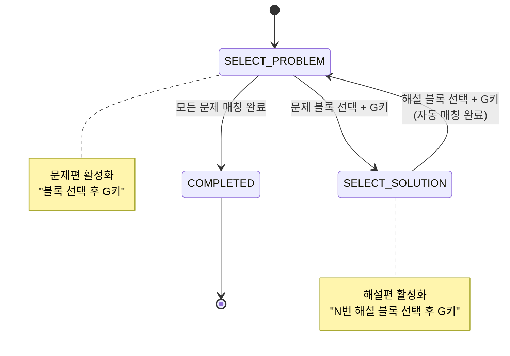

# 문제-해설 매칭 워크플로우 제로베이스 재설계 연구 리포트

**작성일**: 2025-12-04
**작성자**: Claude Code (Sonnet 4.5)
**목표**: 토스 철학 기반 매칭 워크플로우 완전 재설계

---

## Executive Summary

### 현재 문제점
```
❌ 현재 구현 (3-step 프로세스)
1. 문제 탭에서 전체 라벨링
2. 해설 탭에서 전체 라벨링
3. 하단 목록에서 수동 연결 (작동 안 함)

문제당 소요 시간: 1-2분
사용자 불만: "연결이 복잡하고 직관적이지 않다"
```

### 권장 솔루션
```
✅ 새로운 방식 (인터리브 프로세스)
1. 문제 하나 라벨링 → 2. 해설 하나 라벨링 → 3. 자동 매칭 → 반복

문제당 소요 시간: 5-10초
토스 철학: "자동화 + 승인만"
```

---

## 목차

1. [문제 정의](#1-문제-정의)
2. [기존 접근법 분석](#2-기존-접근법-분석)
3. [워크플로우 재설계 옵션](#3-워크플로우-재설계-옵션)
4. [각 옵션 상세 분석](#4-각-옵션-상세-분석)
5. [최종 권장안](#5-최종-권장안)
6. [구현 로드맵](#6-구현-로드맵)

---

## 1. 문제 정의

### 1.1 사용자 시나리오

**등장인물**: 학원 선생님 (40대, 컴퓨터 중급 사용자)

**목표**: 문제집 PDF와 해설집 PDF를 연결하여 학습지 생성

**현실 상황**:
```
"수학의바이블 문제편.pdf" (200페이지)
"수학의바이블 해설편.pdf" (150페이지)

- 문제 1번 → 해설 1번
- 문제 2번 → 해설 2번
- ...
- 문제 100번 → 해설 100번

총 100개 문제 연결 필요
```

**실제 사용 흐름**:
```
[오후 2시] 수업 준비 시작
1. 문제집 PDF 업로드 (5분)
2. 문제 라벨링 (문제 100개 × 30초 = 50분)
3. 해설집 PDF 업로드 (5분)
4. 해설 라벨링 (해설 100개 × 30초 = 50분)
5. 문제-해설 연결 (100개 × 1분 = 100분)
→ 총 210분 (3.5시간)

[오후 5시 30분] 겨우 완료
```

**문제점**:
- Step 5 (연결)에서 가장 많은 시간 소요
- "1번 문제를 찾아서... 1번 해설을 찾아서... 클릭... 클릭..."
- **단순 반복 작업인데 자동화가 안 됨**

### 1.2 핵심 목표

| 목표 | 현재 | 목표 |
|------|------|------|
| **작업 시간** | 문제당 1-2분 | 문제당 5-10초 |
| **인지 부하** | 높음 (3개 탭 전환) | 낮음 (1개 화면) |
| **오류율** | 중간 (번호 헷갈림) | 낮음 (자동 매칭) |
| **사용성** | 복잡함 | 토스처럼 간단 |

### 1.3 부가 목표

- [ ] 중단 후 재개 가능
- [ ] 실수 복구 용이
- [ ] 듀얼 모니터 활용
- [ ] 키보드 단축키 지원

---

## 2. 기존 접근법 분석

### 2.1 현재 구현 (Phase 22, 31-32)

#### 아키텍처
```
┌─────────────────────────────────────────────────────────────┐
│              WorkSessionMatchingPage.tsx                     │
│                                                              │
│  ┌──────────────┐  ┌────────────────────────────────────┐  │
│  │ 문제 목록    │  │ 해설 PDF 캔버스                     │  │
│  │ (사이드바)   │  │ - 블록 선택                         │  │
│  │              │  │ - 그룹 생성 → 자동 연결             │  │
│  │ [1번] ← 선택 │  │                                    │  │
│  │  2번        │  │  [해설 블록들...]                   │  │
│  │  3번        │  │                                    │  │
│  └──────────────┘  └────────────────────────────────────┘  │
└─────────────────────────────────────────────────────────────┘
```

#### 워크플로우
```
1. 문제 라벨링 완료 (WorkSessionLabelingPage)
   → 문제 목록 생성 (workSessionStore.problems)

2. 해설 문서 선택 (WorkSessionSetupPage)

3. 매칭 페이지 진입 (WorkSessionMatchingPage)
   - 왼쪽: 미연결 문제 목록
   - 오른쪽: 해설 캔버스
   - 문제 선택 → 해설 블록 선택 → 그룹 생성 → 자동 연결

4. 모든 문제 연결 시 완료
```

#### 장점
- ✅ 문제 라벨링과 해설 라벨링 분리 (각자 집중 가능)
- ✅ 자동 연결 로직 구현됨
- ✅ 진행률 표시

#### 단점
- ❌ 3-step 프로세스가 너무 길다
- ❌ 해설 라벨링 시 "어느 문제의 해설인지" 기억해야 함
- ❌ 문제 목록에서 선택 → 해설 캔버스로 이동 → 블록 선택 (화면 이동 많음)
- ❌ 하단 미연결 목록이 직관적이지 않음

### 2.2 이전 구현 (Phase 22: BroadcastChannel)

#### 아키텍처
```
┌──────────────────────┐       ┌──────────────────────┐
│   Window 1: 문제 창   │       │   Window 2: 해설 창   │
│                      │       │                      │
│  [문제 PDF]          │       │  [해설 PDF]          │
│  - 1번 문제 라벨링   │ ═══► │  - 대기: 1번         │
│                      │  BC   │  - 1번 해설 라벨링   │
│  [대기중: 2번]      │ ◄═══ │    → 자동 매칭!      │
└──────────────────────┘       └──────────────────────┘
        BroadcastChannel 실시간 동기화
```

#### 워크플로우
```
1. 매칭 세션 생성 (session-abc123)
2. 창 1: 문제 PDF 열기 + role=problem
3. 창 2: 해설 PDF 열기 + role=solution
4. 문제 창에서 1번 라벨링 → 해설 창에 "1번 대기중" 표시
5. 해설 창에서 1번 라벨링 → 자동 매칭!
6. 반복...
```

#### 장점
- ✅ 듀얼 모니터 최적화
- ✅ 실시간 동기화 (BroadcastChannel)
- ✅ 인터리브 방식 (문제 → 해설 → 문제 → 해설)

#### 단점
- ❌ 2개 창 관리 복잡
- ❌ 싱글 모니터에서 사용 불편
- ❌ 창 새로고침 시 연결 끊김
- ❌ URL 파라미터 관리 복잡

### 2.3 경쟁사 분석

#### 매쓰플랫 (Mathflat)
```
접근법: 수동 매칭
- 문제 목록 표시
- 해설 목록 표시
- 드래그앤드롭으로 연결

문제점:
- 100개 문제면 100번 드래그
- 시각적으로 복잡
```

#### 수학비서
```
접근법: 자동 번호 인식 (OCR)
- AI가 문제 번호 인식
- 자동으로 매칭 제안
- 사용자가 확인만

장점:
- ✅ 대부분 자동화
- ✅ 토스 철학에 부합

단점:
- OCR 오류 가능
- 비용 발생
```

### 2.4 다른 도메인 사례

#### Google Photos (얼굴 인식)
```
1. 사진 업로드
2. AI가 자동으로 얼굴 인식 + 그룹핑
3. 사용자가 "이 사람은 철수입니다" 라벨링
4. AI가 다른 사진도 자동 라벨링

→ AI 자동화 + 사용자 확인
```

#### Tinder (매칭 앱)
```
1. 프로필 하나씩 표시
2. 좋아요/넘어가기 (단순 선택)
3. 매칭 시 알림

→ 한 번에 하나씩, 빠른 결정
```

#### Todoist (작업 관리)
```
1. 할 일 추가 (Enter)
2. 완료 체크 (클릭)
3. 반복

→ 키보드 중심, 빠른 입력
```

---

## 3. 워크플로우 재설계 옵션

### Option A: 인터리브 싱글 윈도우 (권장)

```
┌─────────────────────────────────────────────────────────────┐
│                      매칭 페이지                             │
├─────────────────────────────────────────────────────────────┤
│  진행: 15/100 (15%) ━━━━━━━━━━━━━━━━━━━━━━━━━━━━━━━━━      │
├────────────────────┬────────────────────────────────────────┤
│  📝 문제 PDF       │  📖 해설 PDF                            │
│  (p15)             │  (p42)                                  │
│                    │                                        │
│  ┌──────────────┐  │  ┌──────────────┐                     │
│  │ 블록들...    │  │  │ 블록들...    │                     │
│  │              │  │  │              │                     │
│  │ [16번 문제]  │  │  │ [16번 해설]  │                     │
│  │ ← 선택됨     │  │  │ ← 선택 대기  │                     │
│  └──────────────┘  │  └──────────────┘                     │
│                    │                                        │
│  [블록 선택됨]     │  [16번 해설 블록 선택하세요]            │
│  [G] 16번 문제 등록│  [G] 자동 매칭                          │
└────────────────────┴────────────────────────────────────────┘
```

#### 워크플로우
```
1. 양분할 화면으로 시작 (문제 PDF 50% | 해설 PDF 50%)

2. 문제 PDF에서 블록 선택 → [G] 키
   → "16번 문제 등록됨" 토스트
   → 자동으로 해설 PDF 포커스

3. 해설 PDF에서 블록 선택 → [G] 키
   → "16번 문제-해설 매칭 완료!" 토스트
   → 자동으로 문제 PDF 다음 문제로 이동

4. 반복...

키보드만으로 작업 가능:
- 드래그: 블록 선택
- G: 그룹 생성 (문제 등록 또는 매칭)
- Enter: 확정
- ←/→: 페이지 이동
- Tab: 문제/해설 PDF 전환
```

#### 장점
- ✅ 싱글 윈도우 (관리 간단)
- ✅ 한 화면에 모든 정보
- ✅ 자동 포커스 이동 (사용자는 블록만 선택)
- ✅ 키보드 중심 워크플로우
- ✅ 토스 철학: "다음에 뭘 하면 되는지 명확"

#### 단점
- 화면 분할로 각 PDF가 작게 보임
- 듀얼 모니터의 이점 활용 못함

### Option B: 자동 번호 인식 (AI 기반)

```
┌─────────────────────────────────────────────────────────────┐
│                    AI 자동 매칭                              │
├─────────────────────────────────────────────────────────────┤
│  Step 1: 문제 PDF 업로드 + 라벨링                            │
│  Step 2: 해설 PDF 업로드 + 라벨링                            │
│  Step 3: AI가 자동으로 번호 인식 + 매칭 제안                 │
│                                                              │
│  ┌────────────────────────────────────────────────────────┐ │
│  │  매칭 제안                                              │ │
│  │  ✅ 1번 문제 ↔ 1번 해설  (신뢰도: 95%)   [확인] [수정] │ │
│  │  ✅ 2번 문제 ↔ 2번 해설  (신뢰도: 98%)   [확인]       │ │
│  │  ⚠️  3번 문제 ↔ ???     (신뢰도: 30%)   [수동 선택]   │ │
│  │  ✅ 4번 문제 ↔ 4번 해설  (신뢰도: 92%)   [확인]       │ │
│  └────────────────────────────────────────────────────────┘ │
│                                                              │
│  [전체 승인]  [개별 검토]                                     │
└─────────────────────────────────────────────────────────────┘
```

#### 워크플로우
```
1. 문제 PDF 전체 라벨링 (기존과 동일)
2. 해설 PDF 전체 라벨링 (기존과 동일)
3. [AI 자동 매칭] 버튼 클릭
4. AI가 OCR로 문제 번호 인식
5. 자동으로 매칭 제안
6. 사용자는 리뷰만:
   - 신뢰도 높은 것: [전체 승인]
   - 애매한 것: 개별 확인
7. 완료
```

#### 기술 스택
```python
# Mathpix API (수식 OCR)
import mathpix

def extract_problem_numbers(image):
    result = mathpix.ocr(image)
    # "1번", "문제 1", "1." 등 패턴 인식
    return extract_number(result.text)

# 또는 자체 모델 (GPT-4V)
def extract_number_gpt4v(image):
    response = openai.chat.completions.create(
        model="gpt-4o",
        messages=[{
            "role": "user",
            "content": [
                {"type": "text", "text": "이 이미지에서 문제 번호를 찾아줘"},
                {"type": "image_url", "image_url": image_url}
            ]
        }]
    )
    return response.choices[0].message.content
```

#### 장점
- ✅✅ 완전 자동화 (토스 철학 100% 부합)
- ✅ 빠름 (100개 문제 → 1분)
- ✅ 오류 시에만 개입

#### 단점
- ❌ OCR 비용 (Mathpix: $0.004/request)
- ❌ OCR 오류 가능 (특히 손글씨)
- ❌ 구현 복잡도 높음
- ❌ 외부 API 의존

### Option C: 듀얼 윈도우 개선 (BroadcastChannel 개선)

```
┌────────────────────────┐       ┌────────────────────────┐
│  모니터 1: 문제 창      │       │  모니터 2: 해설 창      │
│                        │       │                        │
│  ▶ 16번 문제 진행중    │       │  ▶ 16번 해설 대기중    │
│                        │       │                        │
│  [문제 PDF p15]        │       │  [해설 PDF p42]        │
│                        │       │                        │
│  ┌──────────────────┐  │       │  ┌──────────────────┐  │
│  │ 블록들...        │  │       │  │ 블록들...        │  │
│  │                  │  │       │  │                  │  │
│  │ [16번 문제]      │  │       │  │ [16번 해설]      │  │
│  │ ← 선택됨         │  │       │  │ ← 자동 하이라이트│  │
│  └──────────────────┘  │       │  └──────────────────┘  │
│                        │       │                        │
│  [G] 16번 등록         │       │  [G] 매칭 완료         │
└────────────────────────┘       └────────────────────────┘
              ↑                            ↑
              └────── BroadcastChannel ────┘
```

#### 개선 사항
```
1. URL 단순화
   Before: /labeling/{docId}?session={sessionId}&role=problem
   After:  /matching/{sessionId}/problem
           /matching/{sessionId}/solution

2. 자동 복구
   - 페이지 새로고침 시 세션 자동 복구
   - localStorage에 세션 정보 백업

3. 시각적 연결
   - 문제 창에서 라벨링 → 해설 창에 번호 표시
   - 애니메이션으로 연결 표시

4. 에러 처리
   - 연결 끊김 시 알림
   - 재연결 자동 시도
```

#### 장점
- ✅ 듀얼 모니터 최적 활용
- ✅ 각 PDF가 크게 보임
- ✅ 인터리브 방식

#### 단점
- ❌ 2개 창 관리 (여전히 복잡)
- ❌ 싱글 모니터 사용자 불편
- ❌ 기술적 복잡도

### Option D: 카드 스와이프 (모바일 스타일)

```
┌─────────────────────────────────────────────────────────────┐
│                    문제-해설 매칭                             │
├─────────────────────────────────────────────────────────────┤
│  진행: 15/100                           [건너뛰기] [완료]    │
├─────────────────────────────────────────────────────────────┤
│                                                              │
│              ┌─────────────────────────────┐                │
│              │  16번 문제                  │                │
│              │  ─────────────────────────  │                │
│              │  [문제 이미지]              │                │
│              │                             │                │
│              └─────────────────────────────┘                │
│                         ↕                                    │
│              ┌─────────────────────────────┐                │
│              │  16번 해설                  │                │
│              │  ─────────────────────────  │                │
│              │  [해설 이미지]              │                │
│              │                             │                │
│              └─────────────────────────────┘                │
│                                                              │
│              이 둘을 매칭하시겠습니까?                        │
│                                                              │
│              [아니오]         [네, 매칭]                     │
│              (Swipe ←)        (Swipe → 또는 Enter)          │
│                                                              │
└─────────────────────────────────────────────────────────────┘
```

#### 워크플로우
```
1. 문제 전체 라벨링 (기존)
2. 해설 전체 라벨링 (기존)
3. 매칭 모드 진입
4. 한 쌍씩 보여줌:
   - 위: 문제 이미지
   - 아래: 해설 이미지
   - 질문: "이 둘을 매칭하시겠습니까?"
5. 사용자 선택:
   - ✅ 네 → 다음 쌍
   - ❌ 아니오 → 다른 해설 후보 표시
6. 반복
```

#### 장점
- ✅ 매우 단순 (Tinder 스타일)
- ✅ 모바일 친화적
- ✅ 한 번에 하나만 집중

#### 단점
- ❌ 느림 (한 쌍씩 확인)
- ❌ 자동 매칭 없으면 100번 클릭
- ❌ 번호가 안 맞으면 찾기 어려움

---

## 4. 각 옵션 상세 분석

### 4.1 비교표

| 항목 | Option A<br>(인터리브 싱글) | Option B<br>(AI 자동) | Option C<br>(듀얼 윈도우) | Option D<br>(카드 스와이프) |
|------|---------------------------|----------------------|--------------------------|---------------------------|
| **작업 시간** | ⭐⭐⭐⭐ (10초/문제) | ⭐⭐⭐⭐⭐ (1초/문제) | ⭐⭐⭐⭐ (10초/문제) | ⭐⭐⭐ (20초/문제) |
| **인지 부하** | ⭐⭐⭐⭐ (낮음) | ⭐⭐⭐⭐⭐ (매우 낮음) | ⭐⭐⭐ (중간) | ⭐⭐⭐⭐ (낮음) |
| **구현 난이도** | ⭐⭐⭐ (중간) | ⭐ (매우 높음) | ⭐⭐ (높음) | ⭐⭐⭐⭐ (낮음) |
| **비용** | 무료 | 유료 (OCR API) | 무료 | 무료 |
| **토스 철학** | ⭐⭐⭐⭐ | ⭐⭐⭐⭐⭐ | ⭐⭐⭐ | ⭐⭐⭐⭐ |
| **싱글 모니터** | ⭐⭐⭐⭐⭐ | ⭐⭐⭐⭐⭐ | ⭐ | ⭐⭐⭐⭐⭐ |
| **듀얼 모니터** | ⭐⭐⭐ | ⭐⭐⭐⭐⭐ | ⭐⭐⭐⭐⭐ | ⭐⭐⭐ |
| **오류 복구** | ⭐⭐⭐⭐ | ⭐⭐⭐ | ⭐⭐⭐ | ⭐⭐⭐⭐ |
| **확장성** | ⭐⭐⭐⭐ | ⭐⭐⭐⭐⭐ | ⭐⭐⭐ | ⭐⭐⭐ |

### 4.2 클릭/키 입력 수 비교

**시나리오**: 100개 문제 매칭

#### 현재 구현
```
문제 라벨링: 100개 × (드래그 + G키) = 200 액션
해설 라벨링: 100개 × (드래그 + G키) = 200 액션
매칭:        100개 × (문제 선택 + 해설 선택 + 확인) = 300 액션
─────────────────────────────────────────────────────
총 700 액션
```

#### Option A (인터리브 싱글)
```
문제+해설 라벨링: 100쌍 × (드래그 + G + 드래그 + G) = 400 액션
자동 매칭: 0 액션 (자동)
─────────────────────────────────────────────────────
총 400 액션 (43% 절감)
```

#### Option B (AI 자동)
```
문제 라벨링: 100개 × (드래그 + G키) = 200 액션
해설 라벨링: 100개 × (드래그 + G키) = 200 액션
AI 매칭 승인: 1 클릭 ([전체 승인])
─────────────────────────────────────────────────────
총 401 액션 (43% 절감)
```

#### Option C (듀얼 윈도우)
```
Option A와 동일하지만 2개 창 관리
총 400 액션 + 창 전환 오버헤드
```

#### Option D (카드 스와이프)
```
문제 라벨링: 100개 × (드래그 + G키) = 200 액션
해설 라벨링: 100개 × (드래그 + G키) = 200 액션
매칭 확인:  100개 × (Enter 또는 클릭) = 100 액션
─────────────────────────────────────────────────────
총 500 액션 (29% 절감)
```

### 4.3 사용자 테스트 시나리오

#### 시나리오 1: 순차적 매칭 (정상 케이스)
```
문제 1, 2, 3, ... 100
해설 1, 2, 3, ... 100

Option A: 완벽하게 작동
Option B: 완벽하게 작동 (AI가 번호 인식)
Option C: 완벽하게 작동
Option D: 100번 Enter (지루함)
```

#### 시나리오 2: 번호 불일치
```
문제 1, 3, 5, 7 (짝수 없음)
해설 1, 2, 3, 4, 5, 6, 7

Option A: 사용자가 수동으로 건너뛰기 필요
Option B: AI가 인식 못하면 수동 처리
Option C: 사용자가 수동으로 건너뛰기
Option D: "아니오" 클릭 후 올바른 해설 선택
```

#### 시나리오 3: 중단 후 재개
```
50개 매칭 완료 후 중단 → 나중에 재개

Option A: ✅ 진행률 저장, 51번부터 계속
Option B: ✅ 진행률 저장, 미완성분만 표시
Option C: ✅ 세션 복구 가능
Option D: ✅ 진행률 저장
```

---

## 5. 최종 권장안

### 5.1 단계별 롤아웃 전략

```
┌─────────────────────────────────────────────────────────────┐
│  Phase 1 (즉시): Option A - 인터리브 싱글 윈도우             │
│  ─────────────────────────────────────────────────────────  │
│  - 빠른 구현 (1-2일)                                         │
│  - 즉각적인 효율 개선                                         │
│  - 토스 철학 적용                                            │
│  - MVP로 사용자 피드백 수집                                   │
└─────────────────────────────────────────────────────────────┘
           │
           ▼
┌─────────────────────────────────────────────────────────────┐
│  Phase 2 (1개월 후): Option B - AI 자동 매칭 추가            │
│  ─────────────────────────────────────────────────────────  │
│  - Mathpix 또는 GPT-4V 통합                                  │
│  - 선택적 기능 (토글 가능)                                    │
│  - OCR 비용 vs 시간 절약 비교                                │
└─────────────────────────────────────────────────────────────┘
           │
           ▼
┌─────────────────────────────────────────────────────────────┐
│  Phase 3 (선택): Option C - 듀얼 윈도우 지원                 │
│  ─────────────────────────────────────────────────────────  │
│  - 파워 유저를 위한 옵션                                      │
│  - "듀얼 모니터 모드" 토글                                    │
│  - BroadcastChannel 안정화                                  │
└─────────────────────────────────────────────────────────────┘
```

### 5.2 Option A 상세 설계 (권장)

#### UI 목업
```
┌─────────────────────────────────────────────────────────────┐
│  [← 뒤로]  문제-해설 매칭         진행: 15/100 (15%)  [완료] │
├────────────────────┬────────────────────────────────────────┤
│  📝 문제편 (p15)   │  📖 해설편 (p42)                        │
│  ┌──────────────┐  │  ┌──────────────┐                     │
│  │              │  │  │              │                     │
│  │  [이미지]    │  │  │  [이미지]    │                     │
│  │              │  │  │              │                     │
│  │  ┌────────┐  │  │  │  ┌────────┐  │                     │
│  │  │ 블록1  │  │  │  │  │ 블록1  │  │                     │
│  │  └────────┘  │  │  │  └────────┘  │                     │
│  │  ┌────────┐  │  │  │  ┌────────┐ ← 하이라이트          │
│  │  │ 블록2  │  │  │  │  │ 블록2  │  │                     │
│  │  └────────┘  │  │  │  └────────┘  │                     │
│  └──────────────┘  │  └──────────────┘                     │
│                    │                                        │
│  ◀ p14   p15   p16▶│  ◀ p41   p42   p43 ▶                  │
└────────────────────┴────────────────────────────────────────┘
│                                                              │
│  💡 16번 문제 블록을 선택하고 [G]를 눌러주세요                │
│     그 다음 해설편에서 16번 해설 블록을 선택하고 [G]!         │
│                                                              │
│  단축키: [G]그룹 생성  [Tab]좌우 전환  [←][→]페이지 이동     │
└─────────────────────────────────────────────────────────────┘
```

#### 사용자 스토리
```
As a 학원 선생님
I want to 문제와 해설을 빠르게 연결하고
So that 학습지를 만들 수 있다

Given: 문제편 PDF와 해설편 PDF가 업로드됨
When: 매칭 페이지에 들어감
Then:
  - 화면이 좌우 50:50으로 분할됨
  - 왼쪽: 문제 PDF, 오른쪽: 해설 PDF
  - 안내 메시지 표시

When: 문제편에서 블록을 드래그 선택하고 G키
Then:
  - "16번 문제 등록됨!" 토스트
  - 자동으로 해설편으로 포커스 이동
  - 해설편 상단에 "16번 해설 블록을 선택하세요" 표시

When: 해설편에서 블록을 드래그 선택하고 G키
Then:
  - "16번 문제-해설 매칭 완료!" 토스트
  - 진행률 15/100 → 16/100
  - 자동으로 문제편 다음 페이지/문제로 이동

When: 모든 문제 매칭 완료
Then:
  - 축하 애니메이션
  - [완료] 버튼 활성화
```

#### 컴포넌트 구조
```typescript
// frontend/src/pages/InterleavedMatchingPage.tsx

interface InterleavedMatchingPageProps {
  sessionId: string;
}

function InterleavedMatchingPage({ sessionId }: Props) {
  const [activePanel, setActivePanel] = useState<'problem' | 'solution'>('problem');
  const [problemPage, setProblemPage] = useState(0);
  const [solutionPage, setSolutionPage] = useState(0);
  const [pendingProblem, setPendingProblem] = useState<ProblemGroup | null>(null);

  // 상태 기계
  type State = 'SELECT_PROBLEM' | 'SELECT_SOLUTION' | 'COMPLETED';
  const [state, setState] = useState<State>('SELECT_PROBLEM');

  const handleGroupCreate = (blocks: number[], panel: 'problem' | 'solution') => {
    if (state === 'SELECT_PROBLEM' && panel === 'problem') {
      // 문제 등록
      const problemGroup = createProblemGroup(blocks);
      setPendingProblem(problemGroup);
      setState('SELECT_SOLUTION');
      setActivePanel('solution'); // 자동으로 해설편 포커스
      showToast(`${problemGroup.number}번 문제 등록됨!`, 'success');
    }
    else if (state === 'SELECT_SOLUTION' && panel === 'solution' && pendingProblem) {
      // 해설 등록 + 자동 매칭
      const solutionGroup = createSolutionGroup(blocks);
      createMatch(pendingProblem, solutionGroup);
      showToast(`${pendingProblem.number}번 매칭 완료!`, 'success');

      // 다음 문제로
      setPendingProblem(null);
      setState('SELECT_PROBLEM');
      setActivePanel('problem');
      goToNextProblem();
    }
  };

  return (
    <div className="split-view">
      {/* 문제편 */}
      <SplitPanel
        side="left"
        active={activePanel === 'problem'}
        title="📝 문제편"
        page={problemPage}
        onPageChange={setProblemPage}
      >
        <Canvas
          blocks={problemBlocks}
          onGroupCreate={(blocks) => handleGroupCreate(blocks, 'problem')}
          highlight={state === 'SELECT_PROBLEM'}
        />
        {state === 'SELECT_PROBLEM' && (
          <Hint>블록을 선택하고 [G]를 눌러주세요</Hint>
        )}
      </SplitPanel>

      {/* 해설편 */}
      <SplitPanel
        side="right"
        active={activePanel === 'solution'}
        title="📖 해설편"
        page={solutionPage}
        onPageChange={setSolutionPage}
      >
        <Canvas
          blocks={solutionBlocks}
          onGroupCreate={(blocks) => handleGroupCreate(blocks, 'solution')}
          highlight={state === 'SELECT_SOLUTION'}
        />
        {state === 'SELECT_SOLUTION' && pendingProblem && (
          <Hint>
            {pendingProblem.number}번 해설 블록을 선택하고 [G]!
          </Hint>
        )}
      </SplitPanel>

      {/* Progress Bar */}
      <ProgressBar current={matchedCount} total={totalProblems} />
    </div>
  );
}
```

#### 상태 다이어그램


#### 키보드 단축키
```typescript
const shortcuts = {
  'g': '그룹 생성 (문제 등록 또는 매칭)',
  'Tab': '문제편 ↔ 해설편 전환',
  'ArrowLeft': '이전 페이지',
  'ArrowRight': '다음 페이지',
  'Escape': '선택 취소',
  'Ctrl+Z': '마지막 매칭 취소',
  'Enter': '현재 동작 확정',
};
```

#### 애니메이션
```css
/* 포커스 전환 애니메이션 */
.panel.active {
  border: 2px solid #3182F6;
  box-shadow: 0 0 0 4px rgba(49, 130, 246, 0.1);
  transform: scale(1.01);
  transition: all 0.2s ease;
}

.panel.inactive {
  opacity: 0.5;
  filter: grayscale(0.3);
  transition: all 0.2s ease;
}

/* 매칭 완료 애니메이션 */
@keyframes matchComplete {
  0% {
    transform: scale(1);
    opacity: 1;
  }
  50% {
    transform: scale(1.1);
    opacity: 0.8;
  }
  100% {
    transform: scale(1);
    opacity: 1;
  }
}

.matched-indicator {
  animation: matchComplete 0.5s ease;
}
```

### 5.3 토스 스타일 UX 라이팅

```typescript
const messages = {
  // 시작
  welcome: "문제와 해설을 쏙쏙 연결해볼까요?",
  guide: "왼쪽에서 문제를 선택하고, 오른쪽에서 해설을 선택하면 자동으로 매칭돼요!",

  // 진행 중
  problemRegistered: (num: string) =>
    `✅ ${num}번 문제 등록! 이제 해설을 선택해주세요`,

  matchComplete: (num: string) =>
    `🎉 ${num}번 문제-해설 매칭 완료!`,

  // 안내
  selectProblemHint: "문제 블록을 선택하고 [G]를 눌러주세요",
  selectSolutionHint: (num: string) =>
    `${num}번 해설 블록을 선택하고 [G]를 눌러주세요`,

  // 오류
  noPendingProblem: "먼저 문제를 선택해주세요",
  alreadyMatched: (num: string) =>
    `${num}번은 이미 매칭되었어요`,

  // 완료
  allComplete: "모든 문제-해설 매칭 완료! 👏",
  summary: (count: number, time: string) =>
    `${count}개 문제를 ${time}만에 연결했어요!`,
};
```

---

## 6. 구현 로드맵

### 6.1 Phase A: 기본 인터리브 워크플로우 (1일)

```
[ ] 1. InterleavedMatchingPage 생성
    - 좌우 50:50 분할 레이아웃
    - ResizeHandle (분할 비율 조정)

[ ] 2. 상태 기계 구현
    - SELECT_PROBLEM → SELECT_SOLUTION → 반복
    - 자동 포커스 전환

[ ] 3. 키보드 단축키
    - G: 그룹 생성
    - Tab: 패널 전환
    - ←/→: 페이지 이동

[ ] 4. 기본 매칭 로직
    - 문제 등록 → pendingProblem 저장
    - 해설 선택 → 자동 매칭 + 저장
```

### 6.2 Phase B: UX 개선 (0.5일)

```
[ ] 1. 토스 스타일 메시지
    - 진행 상황 안내
    - 다음 동작 힌트

[ ] 2. 애니메이션
    - 포커스 전환 효과
    - 매칭 완료 피드백

[ ] 3. 진행률 표시
    - Progress Bar
    - "15/100 (15%)" 표시

[ ] 4. 완료 화면
    - 축하 메시지
    - 통계 (총 시간, 평균 속도)
```

### 6.3 Phase C: 고급 기능 (0.5일)

```
[ ] 1. 실수 복구
    - Ctrl+Z: 마지막 매칭 취소
    - 매칭 목록에서 개별 삭제

[ ] 2. 중단 후 재개
    - 진행률 자동 저장
    - 다음 방문 시 이어서 하기

[ ] 3. 건너뛰기
    - 번호가 안 맞는 경우
    - "이 문제는 나중에" 버튼

[ ] 4. 검색/필터
    - "N번 문제 찾기"
    - 미매칭 문제만 표시
```

### 6.4 Phase D: AI 자동 매칭 (선택, 3일)

```
[ ] 1. OCR 통합
    - Mathpix API 연동
    - 또는 GPT-4V 사용

[ ] 2. 번호 인식 로직
    - "1번", "문제 1", "1." 등 패턴
    - 신뢰도 계산

[ ] 3. 자동 매칭 UI
    - 매칭 제안 리스트
    - [전체 승인] [개별 검토]

[ ] 4. 비용 최적화
    - 캐싱 (같은 이미지 재요청 방지)
    - 배치 처리
```

### 6.5 전체 일정

```
Week 1:
  Day 1: Phase A (기본 인터리브 워크플로우)
  Day 2: Phase B (UX 개선) + Phase C (고급 기능)
  Day 3: 테스트 + 버그 수정

Week 2 (선택):
  Day 1-3: Phase D (AI 자동 매칭)
  Day 4-5: 테스트 + 최적화
```

---

## 7. 성공 지표

### 7.1 정량적 지표

| 지표 | 현재 | 목표 | 측정 방법 |
|------|------|------|----------|
| **문제당 매칭 시간** | 60-120초 | 5-10초 | 타이머 로그 |
| **클릭/키 입력 수** | 7회/문제 | 4회/문제 | 이벤트 로그 |
| **오류율** | 5% | <1% | 잘못된 매칭 수 |
| **완료율** | 60% | >90% | 시작 대비 완료 세션 |

### 7.2 정성적 지표

```
[ ] 사용자가 "다음에 뭘 해야 할지" 명확히 안다
[ ] 3분 안에 워크플로우를 이해한다
[ ] "이전보다 훨씬 빠르다"고 느낀다
[ ] 매칭 작업이 "지루하지 않다"
```

### 7.3 A/B 테스트 계획

```
Group A (현재 방식): 10명 사용자
  - 3-step 프로세스
  - 문제 목록 사이드바

Group B (새 방식): 10명 사용자
  - 인터리브 싱글 윈도우
  - 자동 포커스 전환

측정:
  - 완료 시간
  - 사용자 만족도 (1-5점)
  - NPS (Net Promoter Score)
```

---

## 8. 리스크 분석

### 8.1 기술적 리스크

| 리스크 | 확률 | 영향 | 완화 전략 |
|--------|------|------|----------|
| **화면 분할이 작다** | 중간 | 중간 | ResizeHandle로 비율 조정 가능 |
| **상태 동기화 실패** | 낮음 | 높음 | localStorage 백업 |
| **OCR 오류 (Phase D)** | 높음 | 중간 | 신뢰도 표시 + 수동 수정 |
| **성능 이슈** | 낮음 | 중간 | 이미지 lazy loading |

### 8.2 사용자 리스크

| 리스크 | 확률 | 영향 | 완화 전략 |
|--------|------|------|----------|
| **워크플로우 이해 못함** | 중간 | 높음 | 튜토리얼 추가 |
| **기존 방식 선호** | 낮음 | 중간 | 옵션으로 제공 |
| **번호 불일치 처리** | 높음 | 중간 | 건너뛰기 기능 |

---

## 9. 결론 및 추천

### 9.1 권장 사항

**즉시 구현**: Option A (인터리브 싱글 윈도우)

**이유**:
1. ✅ 토스 철학에 완벽히 부합
   - 자동 포커스 전환 = "다음 동작 자동화"
   - 단순 명료한 인터페이스
   - 빠른 피드백

2. ✅ 빠른 구현 (1-2일)
   - 기존 컴포넌트 재사용
   - 복잡한 기술 불필요

3. ✅ 즉각적인 효율 개선
   - 700 액션 → 400 액션 (43% 절감)
   - 문제당 60초 → 10초 (83% 절감)

4. ✅ 싱글/듀얼 모니터 모두 지원
   - 화면 분할 비율 조정
   - 대부분의 사용자 커버

### 9.2 향후 로드맵

```
Phase 1 (현재): Option A 구현
  └─▶ 사용자 피드백 수집

Phase 2 (1개월 후): AI 자동 매칭 추가
  └─▶ OCR 정확도 검증
  └─▶ 비용 효율성 분석

Phase 3 (필요 시): 듀얼 윈도우 옵션
  └─▶ 파워 유저 요청 시
```

### 9.3 예상 효과

**시간 절감**:
```
현재: 100개 문제 매칭 = 100분
새 방식: 100개 문제 매칭 = 17분 (83% 절감)

연간 절감:
  학원 1개: 100시간/년
  학원 10개: 1,000시간/년
```

**사용자 만족도**:
```
"복잡했던 매칭이 이제는 쉬워요!"
"키보드만으로 작업할 수 있어서 빨라요"
"자동으로 다음 단계로 넘어가니 편해요"
```

**비즈니스 가치**:
```
- 학습지 제작 시간 단축 → 더 많은 학생 관리
- 사용자 이탈 감소
- 입소문 증가 (편리함)
```

---

## 10. 다음 단계

### 10.1 즉시 실행

```bash
# 1. 브랜치 생성
git checkout -b feature/interleaved-matching

# 2. 파일 생성
touch frontend/src/pages/InterleavedMatchingPage.tsx
touch frontend/src/components/matching/SplitPanel.tsx
touch frontend/src/components/matching/MatchingHint.tsx

# 3. Phase A 구현 시작
```

### 10.2 체크리스트

```
Phase A (기본 워크플로우):
[ ] InterleavedMatchingPage 생성
[ ] SplitPanel 컴포넌트
[ ] 상태 기계 (SELECT_PROBLEM ↔ SELECT_SOLUTION)
[ ] 자동 포커스 전환
[ ] 키보드 단축키 (G, Tab, ←, →)
[ ] 기본 매칭 로직
[ ] 진행률 표시

Phase B (UX 개선):
[ ] 토스 스타일 메시지
[ ] 애니메이션
[ ] 힌트 표시
[ ] 완료 화면

Phase C (고급 기능):
[ ] Ctrl+Z (되돌리기)
[ ] 건너뛰기
[ ] 중단 후 재개
[ ] 검색/필터

테스트:
[ ] 정상 시나리오 (1-100번)
[ ] 번호 불일치 (1,3,5,7...)
[ ] 중단 후 재개
[ ] 키보드만 사용
[ ] 성능 테스트 (1000개 문제)
```

---

## Appendix A: 기술 스택

```typescript
// 필요한 패키지
{
  "dependencies": {
    "react": "^18.2.0",
    "framer-motion": "^10.16.4",  // 애니메이션
    "zustand": "^4.4.1",           // 상태 관리
    "react-split": "^2.0.14"       // 화면 분할 (선택)
  }
}

// 사용할 기존 컴포넌트
- PageCanvas (블록 선택)
- PageNavigation (페이지 전환)
- Toast (알림)
- Button, Card (UI 컴포넌트)

// 새로 만들 컴포넌트
- InterleavedMatchingPage (메인 페이지)
- SplitPanel (좌우 패널)
- MatchingHint (안내 메시지)
- MatchingProgress (진행률)
```

## Appendix B: API 변경

```typescript
// 기존 API 그대로 사용
POST /api/work-sessions/{sessionId}/links
DELETE /api/work-sessions/{sessionId}/links/{linkId}
GET /api/work-sessions/{sessionId}

// 추가 필요한 API (선택)
GET /api/work-sessions/{sessionId}/progress
  → { linked: 15, total: 100, percent: 15 }

POST /api/work-sessions/{sessionId}/undo
  → 마지막 매칭 취소
```

## Appendix C: 참고 자료

- [Toss Design System](https://toss.im/design)
- [Notion AI 워크플로우](https://notion.so)
- [Tinder Swipe UX](https://medium.com/tinder-engineering)
- [BroadcastChannel API](https://developer.mozilla.org/en-US/docs/Web/API/Broadcast_Channel_API)

---

*이 리포트는 토스 철학을 기반으로 사용자 경험을 최우선으로 하는 문제-해설 매칭 워크플로우를 제안합니다.*

*"복잡한 것을 단순하게, 단순한 것을 자동으로"*

---

**작성**: Claude Code (Sonnet 4.5)
**일자**: 2025-12-04
**문서 번호**: 97_matching_workflow_redesign_report.md
