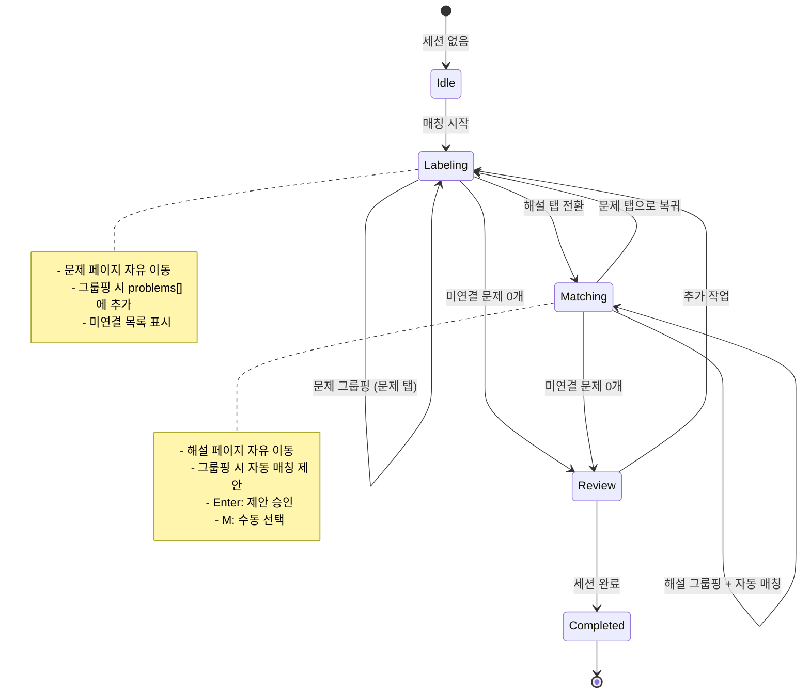

# 유연한 문제-해설 매칭 워크플로우 심층 연구 리포트

**작성일**: 2025-12-04
**목적**: 3가지 매칭 시나리오를 모두 수용하는 통합 워크플로우 설계
**현재 시스템**: Phase 22 듀얼 윈도우 매칭 + Phase 32 작업 세션

---

## Executive Summary

현재 시스템은 **실시간 1:1 매칭**만 지원하며, 선생님의 실제 작업 방식인 **배치 라벨링 → 일괄 매칭**을 지원하지 않습니다. 이 리포트는 3가지 시나리오를 모두 수용하는 통합 워크플로우를 제안합니다.

### 핵심 발견

1. **현재 시스템의 한계**
   - Phase 22: 실시간 1:1 매칭만 지원 (BroadcastChannel 기반)
   - Phase 32: 작업 세션은 있으나 매칭 워크플로우 미연동
   - 문제 라벨링과 매칭이 강제로 연결됨 (배치 작업 불가)

2. **필요한 개선**
   - **큐 시스템**: 미연결 문제 목록 관리
   - **독립적 페이지 네비게이션**: 문제/해설 페이지 독립 이동
   - **수동 매칭 모드**: 문제 선택 → 해설 선택 → 연결
   - **자동 매칭 모드**: 문제 번호 기반 자동 제안

3. **제안 아키텍처**
   - WorkSession을 중심으로 통합
   - 탭 기반 싱글 윈도우 (Phase 31 계획 반영)
   - 듀얼 윈도우는 선택적 모드로 유지

---

## 1. 시나리오 분석

### 시나리오 1: 1:1 즉시 매칭 (현재 지원)

```
[문제 창]                    [해설 창]
페이지 10                    페이지 20

1. 문제 1번 그룹핑
   ↓ (BroadcastChannel)
                            2. 대기 목록에 "1번" 추가

                            3. 해설 1번 그룹핑
                               ↓
                            4. 자동 매칭 (FIFO)
   ← 매칭 완료 알림

5. 문제 2번 그룹핑
   ... 반복
```

**장점**:
- 즉각적인 피드백
- 실수 방지 (그룹핑 직후 확인)

**단점**:
- 페이지 전환 불가능 (실시간 동기화 필요)
- 빠른 작업 속도에 방해
- 문제/해설이 다른 페이지 범위에 있으면 불편

**현재 구현**: Phase 22 (useAutoMatching.ts)

---

### 시나리오 2: 페이지 단위 배치 매칭

```
[단일 창 - 문제 탭]
페이지 10

1. 문제 1번 그룹핑 → 미연결 목록에 추가
2. 문제 2번 그룹핑 → 미연결 목록에 추가
3. 문제 3번 그룹핑 → 미연결 목록에 추가
   ...
7. 문제 7번 그룹핑 → 미연결 목록에 추가

미연결 목록: [1번, 2번, 3번, 4번, 5번, 6번, 7번]

[해설 탭 전환]
페이지 20-22 (여러 페이지 탐색)

8. 해설 1번 그룹핑 → "1번" 자동 제안 → 승인 (Enter)
9. 해설 2번 그룹핑 → "2번" 자동 제안 → 승인
   ...
   (다음 페이지로 이동)
14. 해설 7번 그룹핑 → "7번" 자동 제안 → 승인

미연결 목록: [] (완료!)
```

**장점**:
- 한 번에 한 가지에 집중 (문제만 라벨링 → 해설만 라벨링)
- 페이지 자유 이동 가능
- 빠른 작업 속도

**단점**:
- 매칭 실수 위험 (번호만 보고 판단)

**현재 구현**: 없음 ❌

---

### 시나리오 3: 다중 페이지 배치 매칭

```
[단일 창 - 문제 탭]
페이지 10-12 (여러 페이지 작업)

1-30. 문제 30개 라벨링

미연결 목록: [1-30번] (30개)

[해설 탭 전환]
페이지 20-25 (여러 페이지 탐색)

31-60. 해설 30개 라벨링
       - 각 해설마다 문제 번호 자동 제안
       - 틀린 경우만 수동 선택

미연결 목록: [] (완료!)
```

**장점**:
- 대량 작업에 최적
- 라벨링/매칭 단계 분리

**단점**:
- 기억력 의존 (번호 틀릴 위험)
- 오매칭 발견이 늦음

**현재 구현**: 없음 ❌

---

## 2. 상태 기계 설계

### 2.1 워크플로우 상태 다이어그램



### 2.2 상태 정의

| 상태 | 설명 | UI 표시 | 가능 동작 |
|------|------|---------|----------|
| **Idle** | 세션 없음 | Dashboard | 새 매칭 시작 |
| **Labeling** | 문제 라벨링 | 문제 탭 활성 | 그룹핑, 탭 전환 |
| **Matching** | 해설 매칭 | 해설 탭 활성 | 그룹핑+매칭, 탭 전환 |
| **Review** | 검토 | 완료 화면 | 링크 확인, 수정 |
| **Completed** | 완료 | 세션 목록 | 세션 재오픈, 내보내기 |

### 2.3 데이터 모델 확장

#### 기존 (Phase 32 WorkSession)
```typescript
interface WorkSession {
  sessionId: string;
  problemDocumentId: string;
  solutionDocumentId: string;

  problems: ProblemReference[];  // 라벨링된 문제 목록
  links: ProblemSolutionLink[];  // 문제-해설 연결 목록

  step: 'labeling' | 'setup' | 'matching' | 'completed';
  status: 'active' | 'completed' | 'cancelled';
}
```

#### 확장 제안
```typescript
interface WorkSession {
  // ... 기존 필드 유지

  // 새로 추가
  activeTab: 'problem' | 'solution';  // 현재 활성 탭
  problemPage: number;                 // 문제 탭 페이지 번호
  solutionPage: number;                // 해설 탭 페이지 번호

  // 매칭 모드
  matchingMode: 'auto' | 'manual';     // 자동/수동 매칭

  // 선택된 문제 (수동 매칭용)
  selectedProblemId: string | null;
}

// 미연결 문제 계산 (파생 상태)
function getUnlinkedProblems(session: WorkSession): ProblemReference[] {
  const linkedIds = new Set(session.links.map(l => l.problemGroupId));
  return session.problems.filter(p => !linkedIds.has(p.groupId));
}
```

---

## 3. UI/UX 설계

### 3.1 레이아웃 구조 (싱글 윈도우)

```
┌─────────────────────────────────────────────────────────────────┐
│  📊 매칭 작업: 수학의바이블 기하                    [🖥️ 분리]  │
│  진행률: ████████░░░░ 8/12 (67%)                               │
├─────────────────────────────────────────────────────────────────┤
│  [◉ 문제]  [ 해설]                                             │
├──────────────────────┬──────────────────────────────────────────┤
│  미연결 문제 (4개)   │  페이지 10                              │
│  ┌─────────────────┐ │  ┌─────────────────────────────────┐    │
│  │ ○ 1번          │ │  │                                 │    │
│  │ ○ 2번          │ │  │  [문제 이미지]                  │    │
│  │ ▶ 3번 ⬅ 선택  │ │  │                                 │    │
│  │ ○ 4번          │ │  │  블록 선택 → 그룹핑             │    │
│  └─────────────────┘ │  │                                 │    │
│                      │  └─────────────────────────────────┘    │
│  매칭 완료 (8개)     │                                          │
│  ┌─────────────────┐ │  단축키:                                │
│  │ ⬤ 5번 ↔ 5번   │ │  G: 그룹 생성                            │
│  │ ⬤ 6번 ↔ 6번   │ │  Tab: 다음 탭                            │
│  │ ⬤ 7번 ↔ 7번   │ │  ↑↓: 문제 선택                          │
│  │ ⬤ 8번 ↔ 8번   │ │                                          │
│  └─────────────────┘ │                                          │
└──────────────────────┴──────────────────────────────────────────┘
```

### 3.2 해설 탭 전환 시

```
┌─────────────────────────────────────────────────────────────────┐
│  📊 매칭 작업: 수학의바이블 기하                    [🖥️ 분리]  │
│  진행률: ████████░░░░ 8/12 (67%)                               │
├─────────────────────────────────────────────────────────────────┤
│  [ 문제]  [◉ 해설]                                             │
├──────────────────────┬──────────────────────────────────────────┤
│  다음 매칭 대상      │  페이지 20                              │
│  ┌─────────────────┐ │  ┌─────────────────────────────────┐    │
│  │ 🎯 3번 문제     │ │  │                                 │    │
│  │                 │ │  │  [해설 이미지]                  │    │
│  │ 📷 [썸네일]     │ │  │                                 │    │
│  │                 │ │  │  블록 선택 → 그룹핑             │    │
│  └─────────────────┘ │  │                                 │    │
│                      │  └─────────────────────────────────┘    │
│  안내:               │                                          │
│  해설을 그룹핑하면   │  그룹핑 후:                              │
│  "3번 [해설]"로      │  ┌─────────────────────────────────┐    │
│  자동 매칭됩니다.    │  │ ✅ 3번과 자동 연결              │    │
│                      │  │ [Enter] 승인  [M] 수동 선택    │    │
│  [M] 다른 문제 선택  │  └─────────────────────────────────┘    │
└──────────────────────┴──────────────────────────────────────────┘
```

### 3.3 수동 매칭 모드

```
┌─────────────────────────────────────────────────────────────────┐
│  🔗 수동 매칭                                       [X] 닫기   │
├─────────────────────────────────────────────────────────────────┤
│  해설 그룹: L1 (방금 생성)                                     │
│                                                                 │
│  연결할 문제를 선택하세요:                                      │
│  ┌─────────────────────────────────────────────────────────┐   │
│  │ ○ 1번 - 수학의바이블_기하_p10_1번                      │   │
│  │ ○ 2번 - 수학의바이블_기하_p10_2번                      │   │
│  │ ◉ 3번 - 수학의바이블_기하_p10_3번  ⬅ 제안             │   │
│  │ ○ 4번 - 수학의바이블_기하_p11_4번                      │   │
│  │ ○ 5번 - 수학의바이블_기하_p11_5번                      │   │
│  └─────────────────────────────────────────────────────────┘   │
│                                                                 │
│  ┌────────────┐  ┌────────────┐                                │
│  │ ✓ 연결     │  │ ✗ 취소    │                                │
│  └────────────┘  └────────────┘                                │
└─────────────────────────────────────────────────────────────────┘
```

### 3.4 문제 목록 패널 상세

```
┌─────────────────────┐
│  미연결 (4)         │
├─────────────────────┤
│ ○ 1번              │  ← 클릭: 문제 미리보기 표시
│ ○ 2번              │
│ ▶ 3번              │  ← 선택됨 (해설 매칭 대기)
│ ○ 4번              │
├─────────────────────┤
│  매칭 완료 (8)      │
├─────────────────────┤
│ ⬤ 5번 ↔ 5번      │  ← 호버: [🔗 보기] [✕ 해제]
│ ⬤ 6번 ↔ 6번      │
│ ⬤ 7번 ↔ 7번      │
│ ⬤ 8번 ↔ 8번      │
└─────────────────────┘

상태 아이콘:
○ 미연결 (회색)
▶ 선택됨 (파랑)
⬤ 연결됨 (초록)
```

---

## 4. 매칭 로직

### 4.1 자동 매칭 알고리즘

```typescript
/**
 * 해설 그룹핑 시 자동 매칭 제안
 */
function suggestMatch(
  solutionGroup: ProblemGroup,
  unlinkedProblems: ProblemReference[]
): ProblemReference | null {
  // 1. 해설 그룹 이름에서 문제 번호 추출
  const solutionName = solutionGroup.problemInfo?.problemNumber;
  const extractedNumber = extractProblemNumber(solutionName);

  if (!extractedNumber) return null;

  // 2. 미연결 문제 중 번호가 일치하는 것 찾기
  const exactMatch = unlinkedProblems.find(
    p => p.problemNumber === extractedNumber
  );

  if (exactMatch) return exactMatch;

  // 3. 일치하는 것이 없으면 미연결 목록의 첫 번째 (FIFO)
  return unlinkedProblems[0] || null;
}

/**
 * 문제 번호 추출 (정규식)
 */
function extractProblemNumber(text: string | undefined): string | null {
  if (!text) return null;

  // "3번", "3", "문제3", "03" 등 다양한 형식 지원
  const patterns = [
    /(\d+)번/,           // "3번"
    /문제\s*(\d+)/,      // "문제3", "문제 3"
    /^(\d+)$/,           // "3"
    /\[(\d+)\]/,         // "[3]"
  ];

  for (const pattern of patterns) {
    const match = text.match(pattern);
    if (match) return match[1];
  }

  return null;
}
```

### 4.2 수동 매칭 워크플로우

```typescript
/**
 * 수동 매칭 모달 표시
 */
function showManualMatchModal(
  solutionGroupId: string,
  unlinkedProblems: ProblemReference[],
  suggestedProblem: ProblemReference | null
) {
  // 모달 표시
  // - 미연결 문제 목록
  // - 제안된 문제 하이라이트
  // - 사용자 선택 → createLink()
}
```

### 4.3 매칭 생성/삭제

```typescript
/**
 * 문제-해설 연결 생성
 */
async function createLink(
  problemGroupId: string,
  solutionGroupId: string
): Promise<void> {
  const session = workSessionStore.currentSession;
  if (!session) throw new Error('No active session');

  // 1. 로컬 상태 업데이트
  workSessionStore.createLink({
    problemGroupId,
    solutionGroupId,
    solutionDocumentId: session.solutionDocumentId,
    solutionPageIndex: getCurrentPage()
  });

  // 2. groups.json에 링크 정보 저장 (Phase 37-D)
  // - 해설 그룹에 link 속성 추가

  // 3. 다음 미연결 문제 자동 선택
  workSessionStore.selectNextUnlinkedProblem();
}

/**
 * 연결 해제
 */
async function removeLink(problemGroupId: string): Promise<void> {
  // 1. 로컬 상태 업데이트
  workSessionStore.removeLink(problemGroupId);

  // 2. groups.json에서 링크 정보 제거
}
```

---

## 5. 데이터 흐름

### 5.1 문제 그룹 생성 시

```
사용자 동작: 블록 선택 → G 키 또는 Enter

PageViewer.handleCreateGroup()
  ↓
1. 새 그룹 생성 (localGroups에 추가)
  ↓
2. 세션에 문제 추가
   workSessionStore.addProblem({
     groupId, pageIndex, problemNumber, displayName
   })
  ↓
3. 백엔드 API 호출
   POST /api/work-sessions/{sessionId}/problems
  ↓
4. 세션 파일 저장
   dataset_root/work_sessions/ws-{id}.json
  ↓
5. 미연결 목록 UI 업데이트 (자동)
```

### 5.2 해설 그룹 생성 시 (자동 매칭)

```
사용자 동작: 블록 선택 → G 키

PageViewer.handleCreateGroup()
  ↓
1. 새 그룹 생성 (localGroups에 추가)
  ↓
2. 자동 매칭 제안
   const suggested = suggestMatch(newGroup, unlinkedProblems)
  ↓
3. 사용자에게 확인 요청
   ┌──────────────────────────────┐
   │ ✅ "3번"과 자동 연결         │
   │ [Enter] 승인  [M] 수동 선택 │
   └──────────────────────────────┘
  ↓
4a. [Enter] 승인 시
    workSessionStore.createLink(suggested.groupId, newGroup.id)
    ↓
    백엔드 API 호출
    POST /api/work-sessions/{sessionId}/links
    ↓
    그룹에 link 속성 추가
    ↓
    다음 미연결 문제 자동 선택

4b. [M] 수동 선택 시
    수동 매칭 모달 표시
    ↓
    사용자가 문제 선택
    ↓
    createLink()
```

### 5.3 페이지 전환 시

```
사용자 동작: 다음 페이지 버튼 또는 ← →

PageViewer (useEffect [currentPage])
  ↓
1. 이전 페이지 그룹 자동 저장
   saveGroups(prevGroups, prevPage)
  ↓
2. 새 페이지 그룹 로드
   usePageGroups(documentId, currentPage)
  ↓
3. 선택 상태 초기화
   setSelectedBlocks([])
```

### 5.4 탭 전환 시

```
사용자 동작: [해설] 탭 클릭 또는 Tab 키

workSessionStore.setActiveTab('solution')
  ↓
1. 현재 탭 상태 저장
   activeTab: 'solution'
  ↓
2. 해당 탭의 페이지 번호 복원
   currentPage = solutionPage
  ↓
3. 미연결 문제 목록 업데이트 (자동)
  ↓
4. 다음 매칭 대상 문제 표시
   selectedProblemId = unlinkedProblems[0].groupId
```

---

## 6. 키보드 워크플로우

### 6.1 시나리오별 단축키 설계

#### 시나리오 1: 1:1 즉시 매칭 (듀얼 윈도우)

| 창 | 키 | 동작 |
|----|----|------|
| 문제 | G | 그룹 생성 |
| 문제 | Enter | 그룹 생성 |
| 해설 | G | 그룹 생성 + 자동 매칭 |
| 해설 | Enter | 제안 승인 |
| 해설 | M | 수동 매칭 모달 |

#### 시나리오 2/3: 배치 매칭 (싱글 윈도우)

| 탭 | 키 | 동작 |
|----|----|------|
| 공통 | 1 | 문제 탭 전환 |
| 공통 | 2 | 해설 탭 전환 |
| 공통 | Tab | 다음 탭 |
| 공통 | Shift+Tab | 이전 탭 |
| 문제 | G | 그룹 생성 |
| 문제 | Enter | 그룹 생성 |
| 해설 | G | 그룹 생성 + 매칭 제안 |
| 해설 | Enter | 제안 승인 |
| 해설 | M | 수동 매칭 모달 |
| 해설 | ↑ | 이전 문제 선택 |
| 해설 | ↓ | 다음 문제 선택 |
| 해설 | Shift+Tab | 다음 미연결 문제로 이동 |

### 6.2 키보드 전용 워크플로우 예시

```
=== 페이지 단위 배치 매칭 (마우스 없이) ===

[문제 탭]
1. 블록 클릭 (마우스 필수)
2. Enter → 그룹 생성
3. 블록 클릭
4. Enter → 그룹 생성
   ... 7번까지 반복

5. Tab → 해설 탭 전환

[해설 탭]
6. 블록 클릭 (마우스 필수)
7. Enter → 그룹 생성
   → "1번과 자동 연결" 토스트 표시
   → 다음 문제 "2번" 자동 선택

8. 블록 클릭
9. Enter → "2번과 자동 연결"
   ... 7번까지 반복

완료!
```

**개선 포인트**:
- 블록 선택도 키보드로 가능하게? (좌표 기반이라 어려움)
- 현실적으로 마우스 + 키보드 조합이 최선

---

## 7. 에지 케이스 처리

### 7.1 문제 번호 중복

```
상황: 1번 문제가 2개 (1-1번, 1-2번)

해결책:
- displayName으로 구분
  "수학의바이블_기하_p10_1번"
  "수학의바이블_기하_p11_1번"

- 수동 매칭 모달에서 썸네일 표시
- 자동 매칭은 첫 번째만 제안
```

### 7.2 문제 번호 누락 (해설만 있음)

```
상황: 문제는 1,2,4번 / 해설은 1,2,3,4번

해결책:
- 해설 3번 그룹핑 시 매칭 제안 없음
- "매칭할 문제가 없습니다" 경고
- 수동 매칭 모달 표시 (강제)
- 사용자가 수동 선택하거나 "연결 안함" 선택
```

### 7.3 해설 누락 (문제만 있음)

```
상황: 문제는 1,2,3,4번 / 해설은 1,2,4번

해결책:
- 작업 완료 시 미연결 목록 표시
  "3번 문제가 아직 연결되지 않았습니다"

- 사용자 선택지:
  1. 해설 탭으로 돌아가서 추가 작업
  2. "해설 없음"으로 표시하고 완료
```

### 7.4 순서가 다른 경우

```
상황: 문제 순서 1,2,3,4 / 해설 순서 2,1,4,3

해결책:
- 자동 매칭은 번호 기반이므로 정상 동작
  해설 2번 → 문제 2번 자동 제안
  해설 1번 → 문제 1번 자동 제안

- 순서 무관하게 번호만 일치하면 OK
```

### 7.5 그룹 삭제 시 링크 처리

```
문제 그룹 삭제:
1. 관련 링크 자동 삭제
2. 해설 그룹의 link 속성 제거
3. 미연결 목록에서도 제거

해설 그룹 삭제:
1. 관련 링크 자동 삭제
2. 문제가 다시 미연결 목록에 추가
```

---

## 8. 구현 체크리스트

### Phase 1: 데이터 모델 확장 (2시간)

- [ ] workSessionStore에 탭 상태 추가
  - [ ] `activeTab: 'problem' | 'solution'`
  - [ ] `problemPage: number`
  - [ ] `solutionPage: number`
  - [ ] `selectedProblemId: string | null`

- [ ] 파생 상태 계산 함수
  - [ ] `getUnlinkedProblems()`
  - [ ] `getProgress()`

- [ ] 탭 네비게이션 액션
  - [ ] `setActiveTab(tab)`
  - [ ] `setCurrentPage(page)` (탭별)
  - [ ] `selectProblem(id)`
  - [ ] `selectNextUnlinkedProblem()`

### Phase 2: 문제 목록 패널 (3시간)

- [ ] ProblemListPanel.tsx 생성
  - [ ] 미연결 문제 목록 (○)
  - [ ] 매칭 완료 목록 (⬤)
  - [ ] 선택 상태 표시 (▶)
  - [ ] 클릭 시 문제 선택
  - [ ] 호버 시 [보기] [해제] 버튼

- [ ] 키보드 네비게이션
  - [ ] ↑↓ 키로 선택 이동
  - [ ] Enter 키로 선택 확정

- [ ] 스타일링 (토스 스타일)
  - [ ] 카드 레이아웃
  - [ ] 아이콘 색상 (회색/파랑/초록)

### Phase 3: 탭 헤더 개선 (2시간)

- [ ] UnifiedMatchingHeader.tsx 생성
  - [ ] 탭 전환 버튼 ([문제] [해설])
  - [ ] 진행률 표시 (8/12, 67%)
  - [ ] [분리] 버튼 (듀얼 윈도우 모드)

- [ ] 단축키 지원
  - [ ] 1: 문제 탭
  - [ ] 2: 해설 탭
  - [ ] Tab: 다음 탭

### Phase 4: 자동 매칭 제안 UI (3시간)

- [ ] MatchSuggestionToast.tsx 생성
  - [ ] "3번과 자동 연결" 메시지
  - [ ] [Enter] 승인 / [M] 수동 선택 버튼
  - [ ] 키보드 인터랙션

- [ ] 자동 매칭 로직
  - [ ] `suggestMatch()` 함수
  - [ ] `extractProblemNumber()` 정규식
  - [ ] 제안 없으면 수동 모달 표시

### Phase 5: 수동 매칭 모달 (3시간)

- [ ] ManualMatchModal.tsx 생성
  - [ ] 미연결 문제 목록
  - [ ] 제안된 문제 하이라이트
  - [ ] 라디오 버튼 선택
  - [ ] [연결] [취소] 버튼

- [ ] 검색 기능 (선택)
  - [ ] 문제 번호로 필터링
  - [ ] 키보드 네비게이션

### Phase 6: 페이지 네비게이션 독립화 (2시간)

- [ ] 탭별 페이지 상태 분리
  - [ ] 문제 탭: problemPage
  - [ ] 해설 탭: solutionPage
  - [ ] 탭 전환 시 페이지 복원

- [ ] PageViewer 리팩토링
  - [ ] currentPage → getCurrentPage() 사용
  - [ ] 탭 전환 시 자동 저장

### Phase 7: 링크 관리 통합 (2시간)

- [ ] createLink() 통합
  - [ ] workSessionStore 업데이트
  - [ ] groups.json link 속성 추가 (Phase 37-D)
  - [ ] 다음 문제 자동 선택

- [ ] removeLink() 통합
  - [ ] workSessionStore 업데이트
  - [ ] groups.json link 제거
  - [ ] 미연결 목록 복원

### Phase 8: 완료 화면 (1시간)

- [ ] MatchingCompleteView.tsx
  - [ ] 축하 메시지
  - [ ] 통계 표시 (12/12 완료)
  - [ ] [검토] [완료] 버튼

- [ ] 미연결 경고
  - [ ] "3개 문제가 아직 연결되지 않았습니다"
  - [ ] [계속 작업] 버튼

### Phase 9: 듀얼 윈도우 호환성 (2시간)

- [ ] 기존 듀얼 윈도우 모드 유지
  - [ ] BroadcastChannel 동기화
  - [ ] [분리] 버튼 동작

- [ ] 모드 전환
  - [ ] 싱글 → 듀얼: 해설 탭을 새 창으로 분리
  - [ ] 듀얼 → 싱글: 창 합치기 (선택)

### Phase 10: 테스트 및 버그 수정 (3시간)

- [ ] 시나리오 1 테스트 (1:1 즉시 매칭)
- [ ] 시나리오 2 테스트 (페이지 단위)
- [ ] 시나리오 3 테스트 (다중 페이지)
- [ ] 에지 케이스 테스트
  - [ ] 번호 중복
  - [ ] 번호 누락
  - [ ] 그룹 삭제
- [ ] 키보드 워크플로우 테스트

**총 예상 소요**: 23시간 (3일)

---

## 9. 위험 요소 및 완화 방안

### 9.1 기존 코드 충돌

**위험**:
- Phase 22 듀얼 윈도우 코드와 충돌 가능
- useAutoMatching 훅과 로직 중복

**완화**:
- useAutoMatching은 듀얼 윈도우 전용으로 유지
- 싱글 윈도우는 workSessionStore 직접 사용
- 점진적 마이그레이션 (듀얼 → 싱글 우선)

### 9.2 상태 동기화 복잡도

**위험**:
- 탭별 페이지 상태 관리
- 링크 생성 시 여러 곳 업데이트 필요

**완화**:
- Zustand 단일 스토어 사용
- 트랜잭션 방식 업데이트 (원자적)
- 디버깅 도구 활용 (Redux DevTools)

### 9.3 사용자 혼란

**위험**:
- 3가지 시나리오 중 어느 것을 써야 할지 모름
- 탭 전환 시 데이터 손실 우려

**완화**:
- 기본 모드: 싱글 윈도우 배치 매칭
- 듀얼 윈도우는 "고급 옵션"으로 표시
- 온보딩 튜토리얼 제공
- 자동 저장 안내 메시지

### 9.4 성능 이슈

**위험**:
- 대량 문제 (100개+) 시 렌더링 느림
- 페이지 전환 시 저장 지연

**완화**:
- 가상 스크롤링 (react-window)
- 디바운스 저장 유지 (2초)
- 낙관적 UI 업데이트

---

## 10. 다음 단계

### 즉시 실행 가능 (Phase 31 기반)

1. **workSessionStore 탭 상태 추가** (1시간)
   - activeTab, problemPage, solutionPage
   - 기존 Phase 33 코드 활용

2. **ProblemListPanel 프로토타입** (2시간)
   - 미연결/연결 목록만 표시
   - 클릭 동작 없이 UI만

3. **탭 헤더 추가** (1시간)
   - [문제] [해설] 전환 버튼
   - activeTab 상태 연동

### 단기 목표 (1주일)

- Phase 2, 3, 4 완료 (8시간)
- 시나리오 2 기본 동작 (페이지 단위 배치 매칭)

### 중기 목표 (2주일)

- Phase 5, 6, 7 완료 (7시간)
- 시나리오 3 지원 (다중 페이지)
- 에지 케이스 처리

### 장기 목표 (1개월)

- Phase 8, 9, 10 완료 (6시간)
- 듀얼 윈도우 호환성
- 프로덕션 배포

---

## 11. 결론 및 권장사항

### 핵심 통찰

1. **싱글 윈도우 우선**
   - 3가지 시나리오를 모두 수용 가능
   - 듀얼 윈도우는 선택적 모드로 유지
   - Phase 31 계획과 일치

2. **큐 시스템이 핵심**
   - 미연결 문제 목록 = 작업 큐
   - 해설 라벨링 시 FIFO 매칭
   - 수동 오버라이드 지원

3. **독립적 페이지 네비게이션 필수**
   - 탭별 페이지 상태 분리
   - 문제/해설이 다른 페이지 범위에 있을 수 있음

4. **자동+수동 하이브리드**
   - 자동 제안으로 속도 향상
   - 수동 선택으로 정확도 보장

### 권장 우선순위

| 우선순위 | 작업 | 이유 |
|---------|------|------|
| 1 | workSessionStore 탭 상태 | 기반 인프라 |
| 2 | ProblemListPanel | 핵심 UX |
| 3 | 자동 매칭 제안 | 속도 향상 |
| 4 | 수동 매칭 모달 | 정확도 보장 |
| 5 | 완료 화면 | 사용자 만족도 |
| 6 | 듀얼 윈도우 호환 | 선택적 기능 |

### 제안: 점진적 롤아웃

```
Week 1: 프로토타입
- workSessionStore 탭 상태
- ProblemListPanel (표시만)
- 탭 헤더

Week 2: 기본 기능
- 자동 매칭 제안
- 링크 생성/삭제
- 시나리오 2 지원

Week 3: 고급 기능
- 수동 매칭 모달
- 완료 화면
- 시나리오 3 지원

Week 4: 최적화
- 듀얼 윈도우 호환
- 에지 케이스 처리
- 성능 개선
```

### 성공 지표

- **속도**: 문제 10개 매칭 5분 이내 (현재 10분)
- **정확도**: 오매칭률 5% 이하
- **만족도**: 선생님 피드백 긍정적

---

## 부록 A: 상태 다이어그램 (ASCII)

```
                    ┌─────────┐
                    │  Idle   │
                    └────┬────┘
                         │ 매칭 시작
                         ↓
                    ┌─────────┐
                    │Labeling │◄──┐
                    │(문제 탭)│   │
                    └────┬────┘   │
                         │        │ 문제 탭 복귀
                         │ 해설 탭│
                         ↓        │
                    ┌─────────┐   │
                    │Matching │───┘
                    │(해설 탭)│
                    └────┬────┘
                         │ 미연결 = 0
                         ↓
                    ┌─────────┐
                    │ Review  │
                    └────┬────┘
                         │ 완료
                         ↓
                    ┌─────────┐
                    │Completed│
                    └─────────┘
```

---

## 부록 B: 데이터 흐름 다이어그램

```
┌─────────────┐      ┌──────────────┐      ┌─────────────┐
│  문제 탭    │      │WorkSessionStore│    │  해설 탭    │
│             │      │                │    │             │
│ 그룹핑 (G)  │──1──▶│addProblem()   │    │             │
│             │      │                │    │             │
│             │      │problems: [     │    │             │
│             │      │  {id: "1번"}  │    │             │
│             │      │]               │    │             │
│             │      │                │    │             │
│             │      │unlinked: [     │◄───│  그룹핑 (G) │
│             │      │  "1번"         │ 3  │             │
│             │      │]               │    │             │
│             │      │                │    │  제안: 1번  │
│             │      │                │    │             │
│             │      │                │    │  승인 (Enter)│
│             │      │createLink()    │◄───┤             │
│             │      │                │ 4  │             │
│             │      │links: [        │    │             │
│             │      │  1번↔1번      │    │             │
│             │      │]               │    │             │
│             │      │                │    │             │
│             │      │unlinked: []    │────▶│ 다음 문제   │
│             │      │                │ 5  │  자동 선택  │
└─────────────┘      └───────┬────────┘    └─────────────┘
                             │
                             │ 영속화
                             ↓
                     ┌───────────────┐
                     │  Backend API  │
                     │               │
                     │ work_sessions.│
                     │      json     │
                     └───────┬───────┘
                             │
                             ↓
                     ┌───────────────┐
                     │  groups.json  │
                     │               │
                     │  link: {      │
                     │    linkedId   │
                     │  }            │
                     └───────────────┘
```

---

## 부록 C: UI 컴포넌트 트리

```
UnifiedMatchingPage
├── UnifiedMatchingHeader
│   ├── TabButtons ([문제] [해설])
│   ├── ProgressBar (8/12)
│   └── SplitButton ([분리])
│
├── MainLayout
│   ├── ProblemListPanel (Left Sidebar)
│   │   ├── UnlinkedSection
│   │   │   └── ProblemItem[] (○ 1번, 2번...)
│   │   └── LinkedSection
│   │       └── LinkedPairItem[] (⬤ 5번↔5번)
│   │
│   └── PageViewer (Main Content)
│       ├── PageCanvas (문제 또는 해설)
│       └── BlockOverlay
│
└── Modals
    ├── MatchSuggestionToast
    │   └── [Enter] 승인 / [M] 수동
    │
    └── ManualMatchModal
        ├── ProblemList (라디오 버튼)
        └── [연결] [취소]
```

---

*이 리포트는 3가지 매칭 시나리오를 모두 수용하는 유연한 워크플로우 설계를 제안합니다.*
*점진적 구현을 통해 리스크를 최소화하고, 선생님의 실제 작업 방식에 최적화된 경험을 제공할 수 있습니다.*

**다음 단계**: 이 리포트를 검토하고 Phase 1 (데이터 모델 확장)부터 시작하시기 바랍니다.
