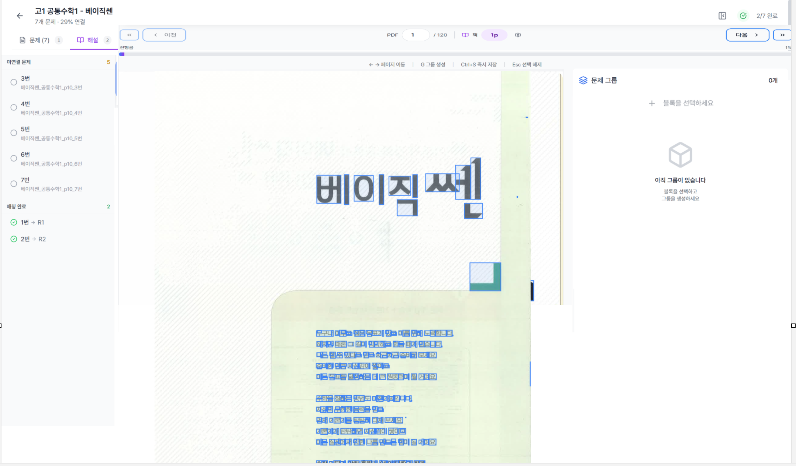

# PDF 뷰어 레이아웃 최적화 연구리포트

> 작성일: 2025-12-22
> 상태: 연구 완료

---

## 1. 현재 상황 분석

### 1.1 스크린샷 분석



**관찰된 문제점**:
1. **오른쪽 여백 과다**: 이미지 오른쪽에 큰 공백이 존재
2. **이미지 세로 크기 부족**: PDF 페이지가 화면 높이를 충분히 활용하지 못함
3. **그리드 정렬**: 현재 `grid-template-columns: repeat(1, 1fr)`로 1열 표시 중

### 1.2 현재 코드 분석

**PdfThumbnailGrid.tsx 크기 계산 로직**:

```typescript
const { pageWidth, columns } = useMemo(() => {
  if (containerSize.width === 0 || containerSize.height === 0) {
    return { pageWidth: 400, columns: 2 }; // 기본값
  }

  const gap = 16; // gap-4
  const padding = 32; // p-4 * 2

  // 1. 높이 기반 페이지 크기 계산
  const availableHeight = containerSize.height - padding;
  const pageHeight = availableHeight - 40; // 라벨 영역
  const heightBasedWidth = pageHeight / 1.414; // A4 비율

  // 2. 너비 기반 최대 열 수 계산
  const availableWidth = containerSize.width - padding;
  const maxColumns = Math.floor((availableWidth + gap) / (heightBasedWidth + gap));

  // 3. 1~4열 범위로 제한
  const finalColumns = Math.max(1, Math.min(4, maxColumns));
  const finalWidth = (availableWidth - gap * (finalColumns - 1)) / finalColumns;

  return {
    pageWidth: Math.min(finalWidth, heightBasedWidth),
    columns: finalColumns,
  };
}, [containerSize]);
```

**문제 원인**:
1. `pageWidth: Math.min(finalWidth, heightBasedWidth)` - heightBasedWidth가 작아서 오른쪽 여백 발생
2. `pageHeight = availableHeight - 40` - 라벨 영역 40px 고정 차감
3. 그리드가 **왼쪽 정렬** (`justify-content: start`)

### 1.3 레이아웃 구조

```
┌─────────────────────────────────────────────────────────────┐
│  헤더 (60px 예상)                                            │
├─────────────────────────────────────────────────────────────┤
│                                                             │
│  ┌─────────────┐                                            │
│  │             │                                            │
│  │   PDF       │        ← 오른쪽 여백 (문제)                 │
│  │   페이지    │                                            │
│  │             │                                            │
│  │             │                                            │
│  └─────────────┘                                            │
│       1                                                     │
│                                                             │
├─────────────────────────────────────────────────────────────┤
│  하단 바 (60px)                                              │
└─────────────────────────────────────────────────────────────┘
```

---

## 2. 문제 원인 상세 분석

### 2.1 오른쪽 여백 발생 원인

**원인 1: 그리드 왼쪽 정렬**
```css
/* 현재 */
className={isLoading ? '' : 'grid gap-4 p-4'}
/* justify-items, justify-content 미설정 → 기본값 start */
```

**원인 2: heightBasedWidth 계산**
```typescript
// 예시: 컨테이너 높이 600px
const availableHeight = 600 - 32; // 568px
const pageHeight = 568 - 40; // 528px
const heightBasedWidth = 528 / 1.414; // 373px

// 컨테이너 너비 900px일 때
const availableWidth = 900 - 32; // 868px
const maxColumns = Math.floor((868 + 16) / (373 + 16)); // 2.27 → 2열

// finalWidth = (868 - 16) / 2 = 426px
// pageWidth = Math.min(426, 373) = 373px
// → 오른쪽에 약 495px 여백 발생 (868 - 373 = 495px)
```

### 2.2 세로 크기 부족 원인

1. **라벨 영역 40px 고정 차감**: 실제 라벨은 약 24px (`py-1.5` + 텍스트)
2. **padding 32px 차감**: 상하 패딩이 크기에 영향
3. **A4 비율 강제 적용**: 실제 PDF 비율이 다를 수 있음

---

## 3. 해결 방안

### 3.1 방안 A: 그리드 중앙 정렬

**변경점**:
```typescript
// Document 컴포넌트에 justify-center 추가
className={isLoading ? '' : 'grid gap-4 p-4 justify-center'}
```

**장점**: 간단, 오른쪽 여백 해결
**단점**: 1열일 때만 효과적, 세로 크기 문제 미해결

### 3.2 방안 B: 너비 우선 계산 (권장)

**현재**: 높이 → 너비 → 열 수
**변경**: 열 수 → 너비 → 높이 검증

```typescript
const { pageWidth, columns } = useMemo(() => {
  if (containerSize.width === 0 || containerSize.height === 0) {
    return { pageWidth: 400, columns: 2 };
  }

  const gap = 16;
  const padding = 32;
  const labelHeight = 28; // py-1.5 + text

  const availableWidth = containerSize.width - padding;
  const availableHeight = containerSize.height - padding;

  // 1. 먼저 원하는 열 수 결정 (1~4열)
  // 화면이 넓으면 더 많은 열
  let targetColumns = 1;
  if (availableWidth >= 1200) targetColumns = 4;
  else if (availableWidth >= 900) targetColumns = 3;
  else if (availableWidth >= 600) targetColumns = 2;

  // 2. 열 수에 맞춰 너비 계산 (여백 없이 꽉 채움)
  const columnWidth = (availableWidth - gap * (targetColumns - 1)) / targetColumns;

  // 3. 높이 제한 검증 (너무 길어지면 열 수 줄임)
  const expectedHeight = columnWidth * 1.414 + labelHeight;
  if (expectedHeight > availableHeight && targetColumns > 1) {
    // 높이 초과 시 열 수 줄이고 재계산
    targetColumns -= 1;
    const newColumnWidth = (availableWidth - gap * (targetColumns - 1)) / targetColumns;
    return {
      pageWidth: newColumnWidth,
      columns: targetColumns,
    };
  }

  return {
    pageWidth: columnWidth,
    columns: targetColumns,
  };
}, [containerSize]);
```

**장점**: 가로 공간 최대 활용, 여백 최소화
**단점**: 세로가 잘릴 수 있음 (스크롤 필요)

### 3.3 방안 C: 높이 최대화 + 중앙 정렬 (권장)

**전략**:
- 높이를 최대로 늘림 (라벨 영역만 제외)
- 그리드를 중앙 정렬
- 열 수는 화면에 맞게 자동 계산

```typescript
const { pageWidth, columns } = useMemo(() => {
  if (containerSize.width === 0 || containerSize.height === 0) {
    return { pageWidth: 400, columns: 2 };
  }

  const gap = 16;
  const padding = 16; // 패딩 축소 (32 → 16)
  const labelHeight = 28;

  const availableWidth = containerSize.width - padding * 2;
  const availableHeight = containerSize.height - padding * 2;

  // 1. 높이 기준 최대 페이지 크기
  const maxPageHeight = availableHeight - labelHeight;
  const maxPageWidth = maxPageHeight / 1.414;

  // 2. 너비에 맞는 열 수 계산
  const maxColumns = Math.floor((availableWidth + gap) / (maxPageWidth + gap));
  const finalColumns = Math.max(1, Math.min(4, maxColumns));

  // 3. 열 수에 따라 실제 너비 결정
  // 옵션 A: 높이 기준 너비 유지 (여백 발생, 중앙 정렬로 해결)
  // 옵션 B: 너비 꽉 채움 (세로가 화면 넘을 수 있음)

  // 옵션 A 선택 (높이 최대화 + 중앙 정렬)
  return {
    pageWidth: maxPageWidth,
    columns: finalColumns,
  };
}, [containerSize]);

// Document에 중앙 정렬 추가
className={isLoading ? '' : 'grid gap-4 p-2 justify-center'}
```

### 3.4 방안 D: Flexbox로 전환

```typescript
// Document 대신 div로 감싸고 flex 사용
return (
  <div ref={containerRef} className="h-full w-full overflow-auto">
    <Document
      file={fileUrl}
      onLoadSuccess={onDocumentLoadSuccess}
      onLoadError={onDocumentLoadError}
      loading={/* ... */}
      className={isLoading ? '' : 'flex flex-wrap justify-center gap-4 p-2'}
    >
      {/* 각 페이지에 고정 크기 적용 */}
      <button style={{ width: pageWidth }}>
        <Page pageNumber={pageNumber} width={pageWidth} />
      </button>
    </Document>
  </div>
);
```

---

## 4. 권장 해결책

### 4.1 1단계: 중앙 정렬 (즉시 적용)

```typescript
// PdfThumbnailGrid.tsx
className={isLoading ? '' : 'grid gap-4 p-4 justify-items-center'}
```

### 4.2 2단계: 높이 최대화

```typescript
const { pageWidth, columns } = useMemo(() => {
  if (containerSize.width === 0 || containerSize.height === 0) {
    return { pageWidth: 400, columns: 2 };
  }

  const gap = 16;
  const padding = 16; // 패딩 축소
  const labelHeight = 28; // 라벨 영역 축소 (40 → 28)

  const availableWidth = containerSize.width - padding * 2;
  const availableHeight = containerSize.height - padding * 2;

  // 높이 기준 최대 페이지 크기 (세로 공간 최대 활용)
  const maxPageHeight = availableHeight - labelHeight;
  const heightBasedWidth = maxPageHeight / 1.414;

  // 너비에 맞는 열 수 계산
  const maxColumns = Math.floor((availableWidth + gap) / (heightBasedWidth + gap));
  const finalColumns = Math.max(1, Math.min(4, maxColumns));

  return {
    pageWidth: heightBasedWidth,
    columns: finalColumns,
  };
}, [containerSize]);
```

### 4.3 3단계: 패딩/마진 최적화

```typescript
// Document 클래스 변경
className={isLoading ? '' : 'grid gap-3 p-2 justify-items-center'}
// gap-4 → gap-3: 간격 축소
// p-4 → p-2: 패딩 축소
```

---

## 5. 예상 결과

### Before (현재)
```
┌─────────────────────────────────────────────────────────────┐
│  헤더                                                        │
├─────────────────────────────────────────────────────────────┤
│  p-4                                                         │
│  ┌─────────────┐                                            │
│  │   PDF       │        ← 여백 ~50%                         │
│  │   (작음)    │                                            │
│  └─────────────┘                                            │
│  p-4                                                         │
├─────────────────────────────────────────────────────────────┤
│  하단 바                                                     │
└─────────────────────────────────────────────────────────────┘
```

### After (개선)
```
┌─────────────────────────────────────────────────────────────┐
│  헤더                                                        │
├─────────────────────────────────────────────────────────────┤
│  p-2                                                         │
│           ┌─────────────────────────┐                       │
│           │                         │                       │
│           │         PDF             │  ← 중앙 정렬          │
│           │        (크게)           │                       │
│           │                         │                       │
│           └─────────────────────────┘                       │
│                       1                                      │
│  p-2                                                         │
├─────────────────────────────────────────────────────────────┤
│  하단 바                                                     │
└─────────────────────────────────────────────────────────────┘
```

---

## 6. 구현 체크리스트

### 필수 변경
- [ ] Document className에 `justify-items-center` 추가
- [ ] padding 축소 (`p-4` → `p-2`)
- [ ] labelHeight 값 조정 (40 → 28)
- [ ] gap 축소 (`gap-4` → `gap-3`)

### 선택 변경
- [ ] 열 수 계산 로직 재검토
- [ ] 너비 기반 열 수 자동 결정 로직 추가

---

## 7. 파일별 변경 요약

| 파일 | 변경 내용 |
|------|----------|
| `PdfThumbnailGrid.tsx` | 중앙 정렬 + 패딩 축소 + 높이 계산 최적화 |

---

## 8. 결론

**핵심 문제**: 높이 기반 너비 계산 후 그리드 왼쪽 정렬로 인한 오른쪽 여백

**권장 해결책**:
1. **즉시 적용**: `justify-items-center` 추가로 중앙 정렬
2. **패딩 축소**: `p-4` → `p-2`, `gap-4` → `gap-3`
3. **라벨 영역 축소**: 40px → 28px

**예상 효과**:
- 오른쪽 여백 해결 (중앙 정렬)
- PDF 세로 크기 증가 (패딩/라벨 축소)
- 전체적으로 더 큰 미리보기 제공

---

*v1.0 - 2025-12-22*
